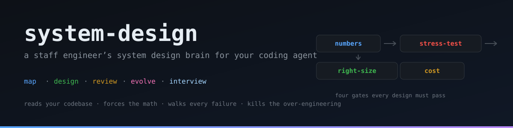

<div align="center">



# system-design

**A staff engineer's system design brain for your coding agent.**

[](LICENSE)
[](.github/workflows/ci.yml)
[](evals/README.md)
[](CONTRIBUTING.md)
[](https://agentskills.io)

</div>

Your coding agent will happily design a Kafka cluster for your 2,000-user startup. It will confidently explain the "best" architecture with zero capacity math, zero failure analysis, and zero interest in the codebase you already run.

This skill fixes that. It makes agents design the way senior engineers actually do — **numbers first, trade-offs explicit, failures walked, complexity justified** — and it does it on the problems you actually have: the existing codebase, the overdue migration, the design doc that's about to get reviewed by people who've seen this before.

## Why this exists

Two failure modes define AI-generated architecture today:

1. **Scale theater.** *"We'll need Kafka, Kubernetes, and microservices — for scale."* For a product with 2,000 users. The skill's right-sizing gate classifies your real scale into one of six tiers and deletes or justifies anything above it.
2. **Hand-waving.** No numbers, no failure modes, no non-goals, no cost. *"It's scalable because we use microservices."* The skill's four gates make these omissions failures, not opinions.

The result is a difference you can hear:

```
You:  "Design a rate limiter for our API across 100 gateway nodes."

Without the skill:
"There are several algorithms... token bucket is popular... Redis can
store counters... choose based on your needs."  — no numbers, no
decision, no failure behavior.

With the skill:
  Read QPS avg / peak        2,400.0 / 7,200.0
  Counter state: ~200 MiB — fits one Redis node. This is a
  throughput/latency/failure problem, not a storage problem.

  Algorithm: sliding window counter (default) — fixed window's
  boundary burst is unacceptable for an API product; sliding log's
  per-key memory is not. Distributed: Redis counters, atomic via Lua.
  Fails OPEN on Redis outage (availability > abuse control — confirm
  as a product decision). 429 + Retry-After, enforced AFTER authN.
  Hot-key: one heavy tenant -> salted sub-counters; at 100x, a
  dedicated shard for the whale. All 12 failure injections walked.
```

## Six modes, auto-detected

| Mode | Ask things like | You get |
|---|---|---|
| **Design** | "design a URL shortener for 100M daily reads" | ADR-style design doc + Mermaid diagram in `docs/design/` |
| **Map** | "what does our architecture actually look like?" | Evidence-based as-is map: components, flows, data stores, risk register — every claim cites a file path |
| **Review** | "review this design doc / PR / ADR" | 10-dimension scored report, blocking findings, verdict: ship / fix-then-ship / redesign |
| **Evolve** | "our monolith's payment code blocks releases" | Phased migration plan (strangler fig, outbox, dual-write + backfill + cutover) with rollback at every phase |
| **Interview** | "mock system design interview, grade me hard" | Curveball-injecting coach + mid/senior/staff grading with cited evidence |
| **Component** | "SQL or NoSQL?", "Kafka vs SQS?", "cache strategy?" | Decision-table answers: default, when to deviate, cost of the choice |

## The four gates

Every design/review/evolve run must pass all four before it's allowed to finish:

1. **Numbers gate** — capacity math runs first (`scripts/botec.py`, bundled calculator), and every component traces to a number: *91 TB / 5 yr ⇒ single Postgres is out.*
2. **Stress-test gate** — the design walks all 12 failure injections: dependency down, 10x spike, hot key, cache stampede, retry storm, split-brain, poison message, slow consumer, region loss, clock skew, cascading failure, metastable failure.
3. **Right-sizing gate** — tier-checked (prototype → planetary). Kafka for 5k users isn't "enterprise-grade", it's a bug.
4. **Cost gate** — rough monthly bill + cost per 1k requests. Two options technically close? Cost decides.

## See it work — real outputs, not mockups

Every file in [`examples/`](examples/) was produced end-to-end by the skill in a fresh agent session, published verbatim:

| Example | What it shows |
|---|---|
| [URL shortener design](examples/design-url-shortener.md) | Snowflake→base62 ID generation, "stampede-by-construction" caching, right-sized monolith |
| [Distributed rate limiter](examples/design-rate-limiter.md) | Capacity-first framing, sliding-window counter, fail-open analysis, 12-injection table |
| [As-is map of a small e-commerce repo](examples/as-is-map-demo-app.md) | Reverse-engineering with file:line evidence + risk register |
| [Checkout design review](examples/review-ecommerce-checkout.md) | 10-dimension scoring, blocking S1 findings, verdict |
| [Payments extraction plan](examples/evolution-extract-payments.md) | Strangler fig + outbox, phase table with rollback per phase |
| [Interview grading](examples/interview-grading-chat-system.md) | Hard L6-grade with cited evidence, "the one thing", drill prescription |

## Does it actually work? Yes — measured.

20 fresh agent sessions, 10 tasks, blind-judged: **with-skill scored 56/56 (100%); baseline scored 46/56 (82%).** The skill didn't just change the answers — it changed the behaviors that matter: baseline recommended Kafka + multi-region + microservices for a 5k-rps URL shortener and produced no artifact for a codebase map; with-skill walked all 12 failure injections, right-sized every design, and persisted artifacts in every mode. Full table + methodology in [`evals/README.md`](evals/README.md). Reproduce it yourself — the eval suite ships in the repo.

## Install

The skill folder is `system-design/` — standard Agent Skills format, works everywhere skills do.

| Tool | Install |
|---|---|
| Any (CLI) | `npx skills add DAAS2/system-design-skill` |
| Claude Code | copy `system-design/` into `~/.claude/skills/` (personal) or `.claude/skills/` (project) |
| Claude Code plugin | `/plugin marketplace add DAAS2/system-design-skill` then `/plugin install system-design` |
| Claude.ai | zip the `system-design/` folder → Settings → Skills → upload |
| OpenCode | copy into `.opencode/skills/` or `~/.config/opencode/skills/` |
| Codex / Gemini CLI / Cursor / Windsurf | copy into the tool's skills directory (Agent Skills standard) |

Verify the install: ask *"how would you architect a ticket booking system?"* — you should see capacity math before components, not a component zoo.

## What's inside

```
system-design/
├── SKILL.md                 # mode router + the four gates (132 lines — ~2k tokens on trigger)
├── scripts/
│   ├── botec.py             # capacity calculator: QPS, storage, bandwidth, servers, cost forces
│   └── test_botec.py        # golden-value tests
└── references/              # loaded on demand — zero context cost until needed
    ├── method-design.md     # the design loop + worked example
    ├── method-map.md        # codebase reverse-engineering procedure + commands
    ├── method-review.md     # 10-dimension adversarial rubric + red-flag catalog
    ├── method-evolve.md     # migration pattern library + phasing skeleton
    ├── method-interview.md  # coach protocol + seniority rubric + curveballs
    ├── stress-tests.md      # the 12 failure injections + antidotes
    ├── numbers.md           # latency/nines/capacity constants (2026, LLM included)
    ├── tradeoffs.md         # decision tables: SQL vs NoSQL, push vs pull, queues...
    ├── data-systems.md      # replication, partitioning, consistency, transactions (DDIA distilled)
    ├── components.md        # building-block catalog with capacity numbers
    ├── problems.md          # 28 classic designs + the one insight that matters in each
    ├── llm-infra.md         # RAG, vector search, LLM serving, agents, GPU scheduling
    ├── cost.md              # tier table, price catalog, cost anti-patterns
    └── output-templates.md  # design doc / map / review / plan templates + Mermaid
```

Knowledge lineage: DDIA (Kleppmann), System Design Interview Vol 1-2 (Alex Xu), Google SRE, Release It!, and the classic papers (Dynamo, Spanner, Aurora, Kafka, Raft, Tail at Scale, PagedAttention) — distilled into checklists an agent will actually enforce, plus the LLM-era layer (RAG, vector search, vLLM-class serving) that predates most system design material.

## How it compares

| | Plain agent | Building-block wikis | **This skill** |
|---|---|---|---|
| Works on your existing codebase | no | no | **yes — map, review, evolve** |
| Forces capacity math before components | rarely | suggested | **hard gate + bundled calculator** |
| Walks failure modes before finishing | rarely | checklist | **hard gate, 12 injections** |
| Kills over-engineering at small scale | no | advises | **hard gate + tier table** |
| Costs the design | no | sometimes | **gate + price catalog** |
| Produces reviewable artifacts | chat only | docs | **docs/ design docs, maps, reports** |
| LLM-era content (RAG, serving, agents) | partial | partial | **dedicated reference** |
| Context cost when idle | n/a | many skills loaded | **one lean SKILL.md, ~2k tokens on trigger** |

## FAQ

**How much context does it cost when not in use?** Only the frontmatter (`name` + `description`, ~120 tokens) is always loaded — the same as any installed skill. The 132-line SKILL.md loads only when a matching request triggers it; references load on demand.

**Does it call external APIs?** No. No network, no keys, no telemetry. `botec.py` is stdlib-only Python doing arithmetic. Install it sight-unseen or audit it — both are fine (see SECURITY.md).

**Is it for interviews or production?** Both. The same loop that produces a defensible interview answer produces a design doc your team can review; the map/review/evolve modes only exist for production work.

**I'm a solo dev on a small app — is this for me?** Especially for you. The right-sizing gate exists precisely so you don't inherit a distributed-systems day job for a tier-1 product. It will also tell you the tripwires at which "boring" stops being right.

**Does it work with Claude.ai / Codex / Cursor / Gemini CLI?** Yes — Agent Skills is an open standard; the folder installs anywhere skills are supported.

**My agent ignored it / the design still sucked.** Open an issue with the prompt and the output — bad designs produced *with* the skill are the most valuable bug reports this repo can get.

## Roadmap

- **v1.1** — provider references (AWS / Azure / GCP managed-service mappings + quotas per component)
- **v1.2** — more worked examples; a second eval iteration with a different model
- **v1.3** — pluggable "company standards" file (your defaults for regions, compliance, banned tech)
- Backlog — LLM-serving capacity calculator, multi-region decision tree, ADR auto-writer

## Contributing

Numbers with sources, new failure injections, new red flags, new classic problems, eval results from your model — all welcome. See [CONTRIBUTING.md](CONTRIBUTING.md). Structure is load-bearing: CI validates the skill (frontmatter, line budgets, reference integrity) on every push.

## Security

This repo ships instructions an AI agent will follow. [SECURITY.md](SECURITY.md) explains the trust model and how to report issues.

---

If this saved you from a Kafka cluster you never needed, star the repo — it's the only payment the maintainers accept.

## License

MIT