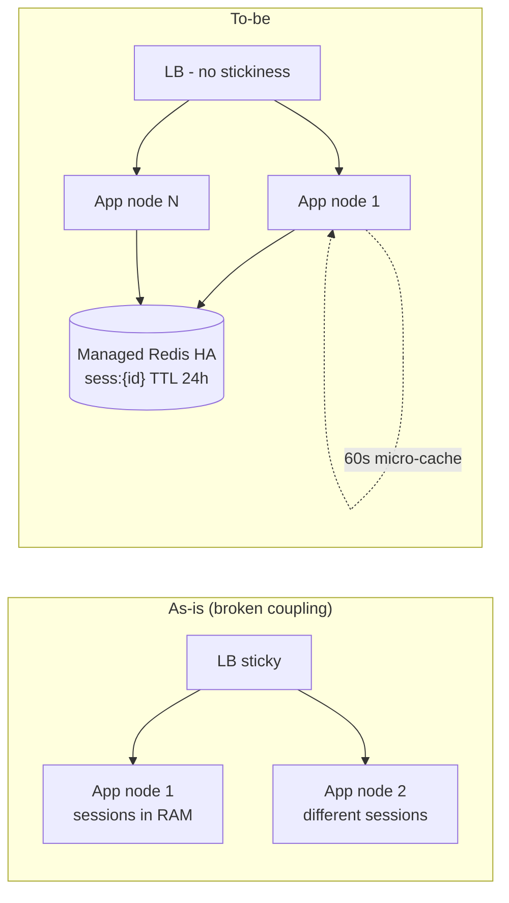

# ADR: Externalize session storage off the app server

Date: 2026-09-03 | Status: Proposed | Author: architecture review
Forcing function: operational risk + blocked scaling (evidence needed before Phase 6 — see "Do not start until")

## Context

Sessions currently live in app-server process memory. This couples three things that should be independent: (1) load balancing (sticky sessions required), (2) deploys and crashes (restart = every user logged out), (3) horizontal scale (adding nodes splits the session population; removing one strands its users). Every rolling deploy today performs an unplanned mass logout, and autoscaling is effectively unusable for the app tier.

**Stated assumptions** (falsifiable — verify before Phase 0 sign-off; all math below assumes them):

- ~200k DAU, ~1.5 sessions/user/day, ~40 requests per session (~12M authenticated requests/day)
- Session record ~1 KiB (user id, roles, CSRF token, a few prefs), sliding TTL 24 h
- Auth consistency: strong for reads (revocation must be prompt-ish); sessions are replaceable state (worst case = re-login), never source-of-truth data
- Latency SLO: authenticated p99 < 200 ms; session lookup must stay < ~2 ms of that budget

### Capacity math (botec.py output)

```
Capacity worksheet
  DAU                                200,000
  Read events/day                    12,000,000      (session lookup per authed request)
  Write events/day                   400,000         (create + throttled TTL touch + delete)
  Read:write ratio                   30:1

  Read QPS avg / peak                138.9 / 416.7
  Write QPS avg / peak               4.6 / 13.9      (touches throttled to ~1/30 min)
  Storage/day (x3 replication)       1.14 GiB
  Hot-set cache (20% of daily)       78 MiB

  App nodes @ 2,000 RPS/node         2 (min 2 for HA)
  In-flight requests at peak         83
Decisions these numbers force:
  - no thresholds crossed: prefer the boring tier-appropriate design
```

Session-specific correction: the 5-year storage figure does not apply — sessions expire. Steady state = sessions created per day × TTL = 300k keys × 1 KiB ≈ **300 MB** (×2 for replication overhead ≈ <1 GB). **Numbers force the conclusion: this migration is about decoupling, not capacity.** Any store will hold it; the decision is which failure and ops profile we accept.

## Decision

Move session storage to **managed Redis (multi-AZ, one small HA replica pair)**, accessed via a `SessionStore` interface, with:

- **Key**: `sess:{session_id}`, **value**: serialized session (~1 KiB), **TTL**: 24 h sliding, touch-throttled (refresh TTL only when >50% expired or ≥30 min since last touch — avoids 12M writes/day of touch amplification)
- **No persistence requirements**: Redis is the only home for sessions; RDB/AOF snapshots off (a flushed Redis = mass re-login, which we accept; we do not pay replication-disk tax for replaceable state)
- **Eviction policy**: `noeviction` — sessions are live state, not a cache; sizing (≥1 GB with 300 MB working set) means memory pressure signals a bug, not a policy problem
- **Read micro-cache**: per-instance in-process cache, 60 s TTL, invalidated on logout — rides through Redis failover windows and cuts read QPS by ~an order of magnitude. Accepted cost: revocation (ban/logout-everywhere) can lag up to 60 s during a Redis incident. Normal-path revocation is immediate (cache is checked through, not around, on sensitive routes: password change, role change, explicit logout).
- **Failure posture**: fail-closed — if Redis is unreachable beyond the micro-cache window, authenticated requests get 503 (fast) rather than silently downgrading trust. Login also fails (writes need Redis). Mitigated by multi-AZ automatic failover (~15-30 s).

### Architecture



Read path walk: request → app node (any node) → micro-cache hit? serve (~90 ns) : `GET sess:{id}` (0.2-1 ms same-DC) → extend TTL if throttled-due → proceed. Write path: login → generate id → `SETEX` → Set-Cookie. Logout → `DEL` + local cache eviction.

## Alternatives considered

| Option | Verdict | Cost of the choice |
|---|---|---|
| **Status quo (in-memory + sticky LB)** | Rejected | Deploys mass-logout users; autoscale unusable; node loss strands sessions; the problem we're solving |
| **Signed stateless cookies (JWT-style)** | Rejected *for now* | Solves the store problem but loses server-side revocation and logout-everywhere; rotation/refresh machinery is its own project; revisit only if session store QPS ever approaches a ceiling (it won't — see tripwires) |
| **Sessions table in the primary Postgres** | Rejected | Viable (it's only ~430 peak reads/s) but: puts the hottest read path on the most valuable resource; every request joins the DB's failure domain; row cleanup cron needed; Postgres latency (1-5 ms) eats the SLO budget vs Redis (0.2-1 ms) |
| **Memcached** | Rejected | No replication/failover story — a node loss is a mass logout; Redis HA is the same managed price |
| **DynamoDB / other managed KV** | Rejected | Different failure domain from the app (good) but per-request cost model on a 12M-reads/day path and a second vendor SDK for zero benefit at this scale |
| **Redis Cluster / sharded Redis** | Rejected (over-engineering) | 300 MB / 430 QPS is ~0.1% of a single node's capacity (100k+ ops/s); cluster adds client complexity for nothing |

## Consequences

**Improves (measurably):**
- Rolling deploys and node crashes no longer log anyone out (session lifetime independent of process lifetime) — eliminates today's per-deploy mass logout
- Sticky sessions removed → app tier freely autoscales; LB config simplifies
- Session hot path off the primary DB's blast radius (had we chosen the Postgres option)

**Gets worse (named honestly):**
- New hard dependency in the hottest path: every authed request now touches Redis. Redis region-down = full auth outage (fail-closed). Before, sessions survived a DB outage; now neither is a session lifeline — but Redis-down ≈ the whole tier-down anyway at this size.
- New failure mode: Redis flush/failover bug = mass re-login (annoyance, not data loss — accepted explicitly, not persisted against)
- One more managed service on the bill and in on-call runbooks

**Neutral:**
- Cookie format unchanged; `SessionStore` interface means the swap is invisible to handlers

## Failure-mode walk (the 12 injections)

| # | Injection | Behavior | Mechanism | Residual risk |
|---|---|---|---|---|
| 1 | Dependency down (Redis) | Degrade | 60 s micro-cache rides short failovers; beyond that authed routes fail fast 503 (fail-closed); login fails | Full-auth outage if multi-AZ failover fails; runbook = restore node, users re-login |
| 2 | 10x spike | Survive | 4.2k peak read QPS vs 100k+ ops/s single node; app tier autoscales freely (no stickiness) | Micro-cache keeps per-node Redis fan-out ~sub-100 QPS |
| 3 | Hot key | Survive | No session is meaningfully hotter than others (per-user bound); micro-cache absorbs per-node repetition | Bot hammering one session = it just reads fast; rate-limit at edge |
| 4 | Cache stampede (Redis restart empty) | Degrade | Sessions are the store, not a cache over an origin — empty Redis = mass re-login, an auth *spike* not a DB stampede; login is cheap | Login burst after flush; throttled by login rate limiting (existing) |
| 5 | Retry storm | Survive | 503 + `Retry-After` on session-store timeout (200 ms, never infinite); SDK retries with jitter + budget | None novel |
| 6 | Partition / split-brain | Survive | Sessions are single-key, single-writer-per-key (the session owner); no leader election in design; replica promotion is whole-node | Stale read from lagging replica post-failover ≤ replication lag; harmless (re-read on next request) |
| 7 | Poison message | N/A | No queue in this design | — |
| 8 | Slow consumer | N/A | No queue; nearest analog is touch throttling (already designed in) | — |
| 9 | Region loss | Die (accepted) | Single-region deployment; Redis lost = re-login after regional failover. Redesign note: cross-region session replication is NOT justified at tier 2 (see Evolution) | Users re-login once per regional disaster |
| 10 | Clock skew | Survive | TTL expiry is Redis-server-side, single clock; app never orders by wall clock | None |
| 11 | Cascading failure | Survive | Session-store calls: 200 ms timeout, circuit breaker (open → fast 503, half-open probe), dedicated connection pool (bulkhead) — a hanging Redis cannot exhaust app threads or block health checks | Breaker flapping during brownouts → periodic 503s; alert on it |
| 12 | Metastable failure | Survive | Redis saturation self-corrects (it's the fastest component); the app tier's breaker sheds auth load *below* capacity, preventing retry-loop saturation; deploys keep sessions warm by design (external store) | None identified |

## Right-sizing & cost

- **Tier: 2 (Growth, 50k-500k users/day)** on the stated assumption. Session externalization is *the* tier-1→2 move — this is the boring default, not scale theater.
- Above-tier components: none. Explicitly rejected above: Redis Cluster, multi-region sessions, JWT machinery.
- **Monthly cost (approximate — verify current pricing):** managed Redis, 1 GB-class, multi-AZ HA: **~$60-160/mo**. That is the entire delta. At ~12M req/day ≈ 360M/mo, cost per 1k requests ≈ **$0.0004**. Two cost levers if needed: single-AZ (~halves it, not recommended), smaller node (already minimal).

## Migration (expand-contract; no backfill — sessions are ephemeral)

Key insight: session data needs **no migration**. Old in-memory sessions expire on their own within one TTL window. New sessions go to Redis; old ones age out. Dual-write is unnecessary; a simple flag suffices.

| # | Phase | Action | Verification | Rollback | Soak |
|---|---|---|---|---|---|
| 0 | Instrument | Dashboards: active session count, create/delete rate, login success rate, p99 session lookup | Baseline captured | n/a | 3 days |
| 1 | Expand | Deploy `SessionStore` interface + Redis impl behind flag `sessions.redis_writes` (default off); wire fail-closed path + breaker | Flag off = byte-identical behavior; integration tests | Delete code | 1 day |
| 2 | Cut over writes (new sessions) | Enable `sessions.redis_writes` canary 5% → 100%; in-memory reads still honored for legacy sessions | Login success rate Δ < 0.1%; session lookup p99 < 5 ms; 0 spike in 401s on non-flagged cohort | Flip flag off (in-memory sessions were never destroyed) | 48 h (≥2× TTL) |
| 3 | Natural drain | Legacy in-memory sessions age out; remove memory read path | Memory read path hit rate → 0 | Re-enable memory reads (code still present) | 1 week |
| 4 | Contract | Delete in-memory store, flags, and sticky-session LB config; remove `worker_processes`-pinned session assumptions | Post-cleanup deploy with rolling restart: 0 forced logouts (the acceptance test) | Irreversible — requires Phase 3 clean metrics: error rate Δ < 0.1% for 7 days | — |

Mid-migration risks: hidden in-memory session consumers (admin tooling, job server reading sessions directly — grep before Phase 4); dual-read ambiguity during Phase 2 (session created pre-flag must not 401 → memory path kept warm until drain); team pressure to skip Phase 0 (no baseline = cannot verify Phase 2, do not start).

## Evolution

- **Breaks first at 10x** (2M DAU ≈ 4.2k peak session reads/s): nothing — that's still <5% of one Redis node. This design is quiet until well past tier 3.
- **Tripwires to revisit:** Redis CPU > 40% sustained, memory > 70%, or login p99 > 500 ms → scale node class first, Cluster only if a single node can't hold the working set (won't happen before ~100M sessions). If revocation-lag during incidents ever becomes a compliance issue → reconsider persisted sessions (AOF) or the JWT path.
- **Next structural change** (independent of scale): if a second service needs session validation, promote `SessionStore` to a thin shared library *before* anyone is tempted to put sessions behind a network RPC.

## Do not start until

- [ ] Stated assumptions verified against real metrics (DAU, session count, record size, requests/session) — Phase 0 baseline exists
- [ ] No hidden consumers of in-memory sessions (grep + traffic check on Phase 4 scope)
- [ ] Managed Redis multi-AZ failover tested in staging (time the failover; confirm breaker + 503 path)
- [ ] Login rate limiting exists (mitigates the flush/re-login burst of injection #4)

## Open questions

- Revocation-lag tolerance during Redis incidents: is 60 s acceptable for *all* sensitive routes, or do password-change/role-change always go straight through? (Owner: security review — needed by Phase 1)
- Session idle vs absolute timeout: does compliance require an absolute cap (re-auth every N hours) in addition to the 24 h sliding TTL? (Owner: security — needed by Phase 1)
