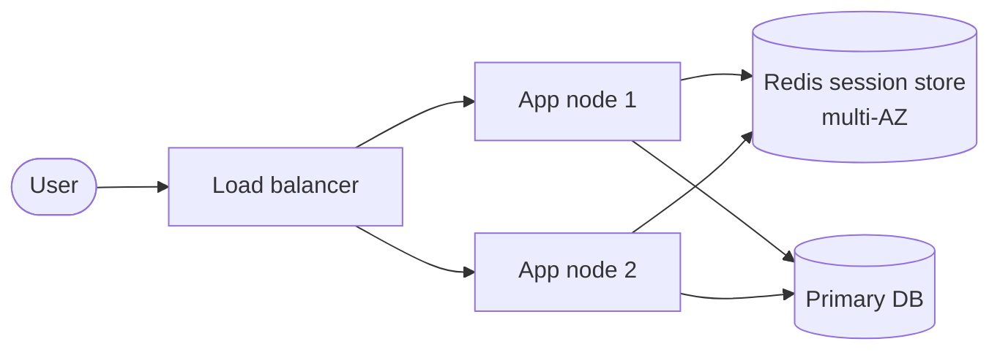

# ADR: Move session storage off the app server
Date: 2026-09-04 | Status: proposed | Forcing function: scale/velocity — sessions pinned to app nodes block horizontal scaling and zero-downtime deploys

## Context

Sessions are currently held in app-server memory (assumed — see Assumptions). That couples the session lifetime to a process: every deploy logs users out, load balancers must pin users to nodes (sticky sessions), a node crash is a logout storm, and scaling out multiplies session stores instead of centralizing them. We want stateless, horizontally scalable app nodes.

**Assumptions (falsifiable — verify before approving):**
- ~100k DAU, ~100 requests/user/day, session blob ~2 KiB (verify real size).
- Forcing function is deploy/scaling pain, not a capacity incident (no incident report on file).
- Single-region deployment; multi-AZ acceptable; team < 20 engineers → managed services preferred (per managed-vs-self-hosted rule).
- Sessions are the only stateful thing on the app node. If files or other in-process state also exist, this ADR covers sessions only.

## Capacity & sizing (assumed 100k DAU)

`botec.py full --dau 100000 --reads-per-user 100 --writes-per-user 5 --read-size 2048 --write-size 2048`:

```
Read QPS avg / peak        116 / 232        (peak factor 2)
Write QPS avg / peak       5.8 / 11.6
App nodes @ 2,000 RPS/node 2 (min 2 for HA)
In-flight at peak          46 (Little's law, 200 ms p99)
```

Session-store sizing derived from these:
- Active sessions ≈ 120k × 2 KiB ≈ **~250 MiB** hot set → smallest managed Redis node suffices (mark: assumes 1.2 sessions/user — verify).
- Session lookups ≈ request QPS → **232 peak lookups/s** vs ~100k ops/s per Redis node → ~0.2% utilization. Survives 10x spike at <4%.
- Every number above rounds to 1-2 significant digits; the decision they force: **one small Redis node carries the entire session load with four orders of magnitude of headroom.**

## Options considered

| Option | Verdict | Because | Cost of choosing it | Revisit when |
|---|---|---|---|---|
| **A. Status quo** (in-memory + sticky LB) | Rejected | Every deploy = fleet-wide logout; node loss = login spike; canary/blue-green broken by pinning | None in $, heavy in ops/deploy friction | Never — it's the problem |
| **B. Relational sessions** (Postgres table) | Rejected (viable fallback) | No new component, durable, ops already known; at 232 QPS Postgres could carry it | +1-5 ms per request on the hot path, per-request churn on the primary, session cleanup job, DB outage now blocks login *and* every authenticated request | If we already run a heavily underutilized primary and refuse any new component |
| **C. Managed Redis, multi-AZ** | **Accepted** | KV-for-sessions is the default shape (tradeoffs table); 0.2-1 ms same-DC GET; native TTL/sliding expiry; isolates auth hot path from DB; Redis is already tier-default infra | New dependency (~$30-80/mo, approximate — verify pricing); async replica failover can lose seconds of writes → affected users re-login | If session becomes durable business data (then B's durability wins) |
| **D. Stateless JWT** | Rejected | Removes the store entirely | No server-side revocation: cannot kill a stolen/banned token before expiry; token bloat on every request | Only if revocation requirements are formally dropped |

## Decision

**Store sessions in managed Redis (multi-AZ, TLS + AUTH), accessed through a single `SessionStore` interface behind a feature flag.** Opaque 128-bit+ random session IDs (no PII in keys), 2 KiB JSON blobs, 30-day sliding TTL refreshed at most once/minute/session. Cookies unchanged (secure, HttpOnly, SameSite).

- The cost is: a new request-path dependency, possible re-logins on failover (async replication), and ~$30-80/mo.
- Revisit when: session-store p99 > 5 ms, Redis memory > 70%, or failovers > 1/month.

### Target architecture



Read path: request → cookie → `SessionStore.get(id)` (Redis GET, 0.2-1 ms) → handler. Miss/invalid → anonymous.
Write path: login/activity → `SessionStore.set(id, blob, TTL)` → cookie. No sticky pinning; any node serves any request.

## Failure modes (scoped to the session store; app-level injections unchanged by this ADR)

| # | Injection | Behavior | Mechanism | Residual risk |
|---|---|---|---|---|
| 1 | Redis down (dependency) | Degrade | 50-100 ms timeout + circuit breaker → public routes serve anonymous; auth routes return clear retry error; managed failover ~10-30 s | Brief login outage; never fail-open to authenticated |
| 2 | 10x traffic spike | Survive | 0.2% → 2-4% Redis utilization; connection pools sized for ~460 in-flight | None expected |
| 3 | Hot key | N/A | Keys are per-user by construction | — |
| 4 | Cache stampede | N/A | Point reads on distinct keys, no shared missing key | — |
| 5 | Retry storm | Survive | Circuit breaker + jittered backoff; fail-to-anonymous breaks the loop | — |
| 6 | Partition/split-brain | Degrade | Managed replica promotion; async loss = seconds of session writes → some users re-login | Acceptable; document as known UX cost |
| 7 | Poison message | N/A | No queue in scope | — |
| 8 | Slow consumer | Degrade | Same as #1: timeout + bulkheaded pool so app threads never pile up | — |
| 9 | Region loss | Degrade | Single-region: sessions lost with region → users re-login after DR | Revisit at multi-region (tier 3) |
| 10 | Clock skew | Survive | TTL enforced server-side by Redis | — |
| 11 | Cascading failure | Survive | Strict timeouts + bulkheads prevent thread-pool exhaustion feeding back into LB | — |
| 12 | Metastable failure | Survive | Fail-to-anonymous + breaker removes the retry amplification that sustains the state | — |

Dying is not acceptable anywhere in this scope; nothing above kills the system.

## Migration plan (expand-contract; sessions are self-migrating — no backfill needed)

| # | Phase | Action | Verification | Rollback | Soak |
|---|---|---|---|---|---|
| 0 | Instrument | Baseline dashboards: login rate, session count, auth-error rate | Dashboards live | n/a | — |
| 1 | Expand | `SessionStore` interface + Redis client, flag off; legacy path untouched | Unit/integration tests; flag off in prod | Delete code | days |
| 2 | Dual-write | On login/activity: write legacy **and** Redis (flag on, reads still legacy) | Redis write success ≥ 99.9%; count diff ≈ 0 | Flag off | 1 week |
| 3 | Read cutover | Reads: Redis first; **on miss, read legacy and copy-forward to Redis** | Session-hit rate on Redis > 99% of legacy; login-error rate delta < 0.1% | Flag flip back; copy-forward makes rollback lossless | 2 weeks |
| 4 | Stop legacy writes | Legacy writes off; Redis is source of truth | Login + session-error metrics clean | Re-enable dual-write (kept warm) | 2 weeks |
| 5 | Contract | Delete legacy session code + flags; **irreversible** | Sign-off owner named; metrics clean | None — deliberate, dated step | n/a |

Key property: sessions migrate lazily as users return (copy-forward), so no backfill job and inactive sessions expire naturally. Mid-migration risks: dual-write divergence (verify counts in Phase 2), hidden consumers of the in-memory store (grep + keep legacy read path until Phase 5), skipping phases under pressure (phase gates in writing with named owner).

## Right-sizing & cost

- **Tier 2** (50k-500k users/day at assumed scale). Redis is in the tier-1 *and* tier-2 default stack — this decision adds **no above-tier component**. JWT (option D) would have been under-tier; sticky sessions are the actual over-engineering here (load-balancer pinning machinery bought to preserve a local store).
- Monthly cost: managed Redis multi-AZ ≈ **$60-160/mo** (2× small node, approximate — verify current pricing); LB sticky config removed saves a little. Cost per 1k requests: < $0.001. If options B and C are judged technically close, cost still favors B by ~$100/mo — we pay it deliberately for hot-path latency, DB blast-radius isolation, and native TTL semantics. That is a named, priced trade-off, not an accident.

## Consequences (what gets worse)

- New dependency on the request hot path (mitigated: breaker + fail-to-anonymous).
- Seconds of session writes can be lost on replica failover → scattered re-logins.
- ~$60-160/mo new spend; one more thing to patch, monitor, and include in DR drills.

## Evolution & tripwires

- Breaks first at 10x (1M DAU ≈ 2.3k peak lookups/s, ~2.5 GiB hot set): still one Redis node; nothing to do.
- Next real change is **multi-region** (tier 3): region-local session stores with home-region affinity; do not build now.
- Tripwires: session-store p99 > 5 ms, Redis memory > 70%, failover > 1/month, or DAU > 500k → reopen this ADR.

## Open questions

- Actual DAU, request rate, and session blob size (owner: platform lead, needed before Phase 1 sizing sign-off).
- Is any session data needed after logout/expiry (audit, "remember this device")? If yes, write-through to the DB for that subset only.
- Compliance requirement for session-data encryption at rest (managed Redis offers it; confirm whether mandatory).
