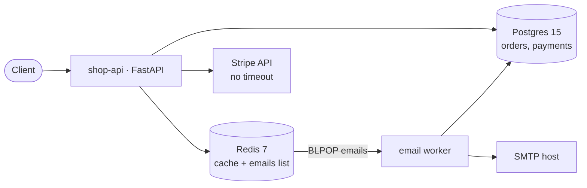

# Architecture (as-is) — Checkout
Date: 2026-09-04 | Codebase state: commit 4c9fc87 (main)

> Scope note: this workspace is the system-design skill's own repo. The only
> application code present is `evals/fixtures/demo-app/` — a checkout demo
> (shop-api + email worker). This map covers that app. No production checkout
> service exists in this workspace; if one lives elsewhere, this map does not
> describe it.

## Summary
A three-endpoint shop API (create order, read order, charge via Stripe) with a
Redis cache-aside layer and a Redis-list-fed email worker, all deployed as a
single docker-compose stack. Runs as one FastAPI container, one worker
container, Postgres 15, Redis 7. Scale: unknown — no metrics, no load data; the
code is explicitly demo-grade ("fine for the demo", db.py:1).

## Container diagram

## Component inventory
| Component | Location (path) | Technology | Role |
|---|---|---|---|
| shop-api | evals/fixtures/demo-app/app/main.py | FastAPI (sync endpoints) | POST /orders, GET /orders/{id}, POST /orders/{id}/charge |
| domain models | evals/fixtures/demo-app/app/models.py | plain dicts | order construction, total calc, status machine created→paid→fulfilled |
| db module | evals/fixtures/demo-app/app/db.py | psycopg2 | raw SQL, one connection per query, DDL at startup |
| cache module | evals/fixtures/demo-app/app/cache.py | redis-py | cache-aside orders, TTL 600s |
| stripe client | evals/fixtures/demo-app/app/payments.py | requests | charge total, no timeout, no idempotency key |
| email worker | evals/fixtures/demo-app/worker/email_worker.py | redis BLPOP + smtplib | sends confirmation email per queued job |
| migrations | evals/fixtures/demo-app/migrations/001_init.sql | raw SQL | "applied by app startup; no migration tool" |
| deploy | evals/fixtures/demo-app/docker-compose.yml | docker-compose | 4 single-instance services, no healthchecks, no replicas |

## Request flows

### Flow 1 — create order (write)
`POST /orders` → main.py:22 create_order → models.py:4 new_order (in-process,
computes total) → db.py:38 insert_order → Postgres `orders` → 201.
No cache write, no payment, no event. Order sits in `created`.

### Flow 2 — read order
`GET /orders/{id}` → main.py:29 → cache.py:13 get_order_cached (Redis key
`order:{id}`) → miss → db.py:51 get_order → cache.py:20 put_order_cached
(TTL 600s) → response. No invalidation anywhere in the codebase.

### Flow 3 — charge (the incident-relevant path)
`POST /orders/{id}/charge` → main.py:40:
1. db.get_order (main.py:42)
2. payments.charge — synchronous HTTPS to Stripe, requests with **no timeout**
   (payments.py:15-19), **no idempotency key**
3. db.insert_payment with hardcoded status "captured" (main.py:47, db.py:70)
4. db.update_order_status "paid" (main.py:48) — **separate connection/commit**
5. Redis `LPUSH emails {order_id, user_id}` (main.py:51-57) — new Redis client
   created per request
Steps 2→3→4→5 are four non-transactional steps; a crash or failure between any
pair leaves Stripe, `payments`, `orders.status`, and the email queue disagreeing.

### Flow 4 — email (async)
email_worker.py:21 main loop → BLPOP `emails` (destructive pop) → opens fresh
Postgres connection → `SELECT user_id FROM orders WHERE id=…` (redundant: job
already carries user_id, email_worker.py:30 vs main.py:57) → SMTP send
(connection per email) → sleep 0.1s (≈10 emails/s ceiling).

## Data stores
| Store | Writers | Readers | Source of truth? | Consistency mechanism |
|---|---|---|---|---|
| Postgres `orders` | db.py:38 insert_order, db.py:62 update_order_status | main.py:42/51, worker (email_worker.py:30) | Yes | — |
| Postgres `payments` | db.py:70 insert_payment | **none** (no code reads it) | Written only | none — no reconciliation job |
| Redis `order:{id}` | cache.py:20 (GET misses only) | cache.py:13 | No | TTL-only (600s); **no invalidation on charge** → stale status served up to 10 min after payment |
| Redis `emails` list | main.py:57 LPUSH | worker BLPOP | No | none — destructive pop, no ack, no DLQ |

## Infrastructure & delivery
- Deploy: docker-compose, 4 services, single instance each, no healthchecks,
  no restart policy beyond compose defaults (docker-compose.yml:2-30).
- Environments: one (local compose); `.env.example` carries a live-style
  Stripe key placeholder (`sk_live_REPLACE_ME`, .env.example:3).
- Migrations: `CREATE TABLE IF NOT EXISTS` DDL executed on every app startup
  (db.py:7-23, db.py:30-35); no migration tool, no down-migrations.
- Observability: **absent** — no logging, metrics, tracing, or alerting code
  anywhere in the app. Nobody can see this system fail.
- CI: none for the demo app.

## Risk register
| Risk | Evidence (file:line) | Severity | First fix |
|---|---|---|---|
| Charge path not idempotent → double charge on client retry | main.py:40-59; payments.py:14-21 (no Idempotency-Key header) | S1 | Send Stripe Idempotency-Key = order_id; make charge a no-op if status=paid |
| Stripe call has no timeout → hung requests pin threads (sync FastAPI) | payments.py:3-4, 15-19 (comment admits it) | S1 | timeout=(2, 10) on requests.post |
| Cache never invalidated on write → stale order status ≤10 min after payment | main.py:48 (status→paid) vs cache.py (no invalidation API exists) | S1 | Delete `order:{id}` in the charge handler, or write-through after update |
| Stripe success vs DB write is not atomic: charge captured but payment row/status lost on crash between steps | main.py:46-48 (two separate connections/commits) | S1 | Single DB transaction for payment+status; reconcile `payments` against Stripe on startup/cron |
| Redis-list queue: destructive pop, no ack, no DLQ → emails lost on worker crash; poison email blocks nothing but is silently dropped | email_worker.py:23-33 | S2 | Move to Redis Streams (XADD/XREADGROUP) or at minimum requeue-on-failure with attempt counter |
| One Postgres connection per query, no pooling (app + per-job in worker) | db.py:26-27; email_worker.py:28 | S2 | Connection pool (psycopg2 pool or pgBouncer) |
| Duplicated/incorrect worker read: re-queries order for user_id it already has, and sends email to `user_id` as SMTP address | email_worker.py:30-33 vs main.py:57 | S2 | Pass address in job payload; fix recipient derivation |
| Payment row status hardcoded "captured"; payments table never read | main.py:47; grep: no reader | S3 | Store actual Stripe response state; add reconciliation reader |
| No migration tooling; DDL at startup; no down-migrations | migrations/001_init.sql:1; db.py:30-35 | S3 | Adopt alembic or plain numbered migrations with a runner |
| Zero observability (no logs/metrics/traces) | repo-wide grep: no logging/metrics imports | S3 | Structured logs + request/Stripe-latency metrics first |
| Single instance of everything, no healthchecks | docker-compose.yml:2-30 | S3 (demo) | Acceptable for demo tier; healthchecks + restart policies if it ever leaves the laptop |

## Not read / unknown
- No production traffic data, latency SLOs, or incident history in the repo.
- examples/as-is-map-demo-app.md and examples/review-ecommerce-checkout.md
  exist but were deliberately not consulted — this map is independent evidence.
- If the "real" checkout system lives outside this workspace, this map must be
  regenerated against that repo before the incident review.
