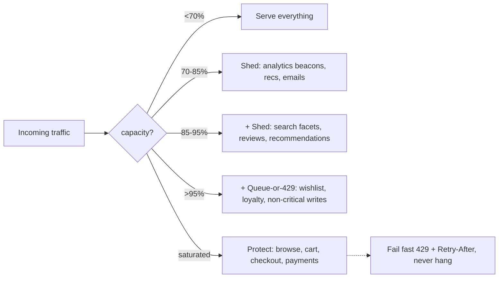

# Capacity Plan: Black Friday 8x Peak

**Date:** 2026-09-03 · **Status:** Template + worked example (swap in your real baseline) · **Mode:** design (capacity planning, Gates 1–4)

## 0. Assumptions (falsifiable — verify each)

| # | Assumption | How to verify |
|---|---|---|
| A1 | "8x" is the 6-hour **window average** vs. a normal day's peak baseline | Check last year's per-minute traffic graph |
| A2 | Baseline normal-day peak = **2,000 RPS** at the API tier | Load balancer metrics |
| A3 | ~2,000 RPS per stateless node at p99 ≤ 200 ms (from `references/numbers.md`) | Load test one node |
| A4 | Responses avg ~20 KB; catalog reads cacheable; checkout writes not | Measure response sizes, cache-hit logs |
| A5 | Peak-of-peak inside the window adds **1.25x** over window average | Last year's 1-minute max ÷ 6-hour average |

## 1. The core math (Gate 1)

**8x for 6 hours, stated three ways — each drives a different decision:**

| Lens | Math | Value | Decision it forces |
|---|---|---|---|
| Sustained rate | 8x baseline peak × 1.25 intra-window burst | **10x** | Stateless tier sized for 10x, not 8x |
| Daily volume | (18h×1 + 6h×8) / 24 = 66/24 | **2.75x** | Storage, logs, queue daily throughput, overnight drain |
| Duration | 6h window (+ramp) ≈ 72h pre-scaled | **0.3% of the year** | Rent the capacity, never buy it permanently |

**botec output** (baseline peak 2,000 RPS, 2k RPS/node):

```
Servers for peak (8x = 16,000 RPS)     8
With N+2 redundancy                   10
Servers for peak (10x burst = 20,000) 10
With N+2 redundancy                   12
Bandwidth at 16k RPS × 20 KB    2.56 Gbit/s
```

**Per-tier plan (illustrative baseline):**

| Tier | Normal peak | BF sustained (8x) | Plan target | Mechanism |
|---|---|---|---|---|
| Stateless API | 2,000 RPS → 3 nodes (N+2) | 16,000 RPS → 10 | **12 nodes, pre-scaled T-1h** | Pre-scale; reactive autoscale is too slow for a cliff ramp |
| Bandwidth (origin) | 0.32 Gbit/s | 2.56 Gbit/s | CDN offloads static/catalog; origin ~3 Gbit/s | CDN first — edges are effectively unbounded |
| DB writes | ~150 w/s | ~1,200 w/s | ≥2,000 w/s capacity (≤60% util) | Single primary survives (refs: 1–5k w/s); provisioned IOPS; do NOT touch schema/sharding this week |
| DB reads | unprotected | only cache misses reach DB | **≥90% cache hit ratio** on catalog | The #1 lever: cache absorbs 8x reads |
| In-flight (Little) | 400 @200 ms | 3,200 | pools sized for **6,400** | If latency doubles, concurrency is 16x — pools die before CPU |
| Queue consumers | 1x | 8x | 8x consumers | A queue delays, it doesn't reduce; 6h at 8x with 1x consumers = backlog drains Sunday |
| Third parties (payments, tax, identity) | — | they see your 8x too | Pre-agreed rate limits confirmed in writing | Classic BF outage: *your* plan is fine, Stripe/tax-API throttle is not |

## 2. Load-shedding ladder (decide the order now, not at 2 AM)



Checkout is protected last-to-die. A quick 503/429 beats a 30-second hang (which converts into retry storms and pool exhaustion).

## 3. Failure-mode walk (Gate 2 — peak-relevant injections)

| Injection | Verdict | Mechanism | Residual risk |
|---|---|---|---|
| 10x spike | **Survive to 10x, shed 10–12x** | Shedding ladder §2; pre-scaled fleet | >12x: degrade gracefully |
| Cache stampede | Degrade | Single-flight/request coalescing; stale-while-revalidate; staggered TTLs (never uniform expiry); warm caches T-30m | Cold cluster restart mid-event = origin hit; keep warmup runbook |
| Retry storm | Degrade | Backoff + full jitter; retry budgets; 429 + Retry-After; idempotent checkout | Naive mobile clients ignore Retry-After |
| Dependency down (payment/tax API) | Degrade | Circuit breaker per dependency; bulkheaded thread pools; queue-and-retry for receipts | Payments down = revenue down; pre-agreed fallback provider if volume justifies |
| Hot key (flash-sale product) | Survive | Replicate hot page in-process + cache; flash-sale pages static-rendered to CDN | First-second miss on a new deal item |
| Cascading failure | Survive | Per-call timeouts (hop budgets sum < 200 ms p99); bulkheads; breakers | Untested breakers are decoration — exercise in load test |
| Metastable failure | Degrade | Shed **below** capacity to break cache-miss→retry cycle; manual kill-switch to shed tier D3 | Requires war-room authority to actually shed |
| 6,8 queue backlog / poison msg | Degrade | DLQ after N attempts; consumer-lag alert; 8x consumers | Lag alert threshold set to minutes, not hours |
| 9 region loss | Scoped out | Multi-AZ yes; multi-region not tier-appropriate for 6h event — accepted risk, documented | |
| 10 clock skew | Scoped out | No leases/ordering added for this event | |

## 4. Cost (Gate 4 — the cheapest part of the plan)

- Burst ≈ **9 extra nodes × 72h** (pre-scale Fri 00:00 → Sun) ≈ low hundreds of dollars on cloud compute (approximate — verify pricing).
- Permanent 8x fleet would cost ~50x more per year for 0.3% utilization. **Rent, don't own.**
- DB: provisioned-IOPS bump for 72h, revert after. No re-architecture purchases during event week.
- Rule: anything bought for Black Friday must be de-provisioned in the runbook with an owner and a date.

## 5. Operational checklist

1. **T-2 weeks:** load test at 10x in staging; exercise breakers and shedding ladder; verify third-party rate limits in writing.
2. **T-1 day:** feature freeze; canary freeze; pre-scale DB IOPS; confirm autoscale floors raised (don't trust reactive scaling).
3. **T-1h:** pre-scale stateless fleet; warm caches (crawl top catalog pages); war room staffed.
4. **During:** watch p99 latency, cache-hit ratio, consumer lag, breaker state; shed by ladder; no deploys.
5. **T+24h:** scale down per runbook; retro on which numbers were wrong (they will be — update A1–A5 for next year).

## 6. Non-goals

No sharding, no multi-region, no microservice splits, no new infrastructure "while we're at it." Single-primary DB + cache + pre-scaled stateless fleet is the tier-appropriate answer for one 6-hour window. Revisit when peak becomes sustained (8x every day), not for one Friday.

## 7. Numbers I need from you to replace the illustrative baseline

1. Current normal-day **peak RPS** at the edge (not daily average) — and last Black Friday's per-minute peak if you have it.
2. Read:write ratio and what fraction of reads are already cache hits today.
3. DB primary write capacity and current peak utilization (%).
4. p99 latency SLO and current per-node saturation point.
5. Third-party dependencies on the checkout path and their rate limits.
