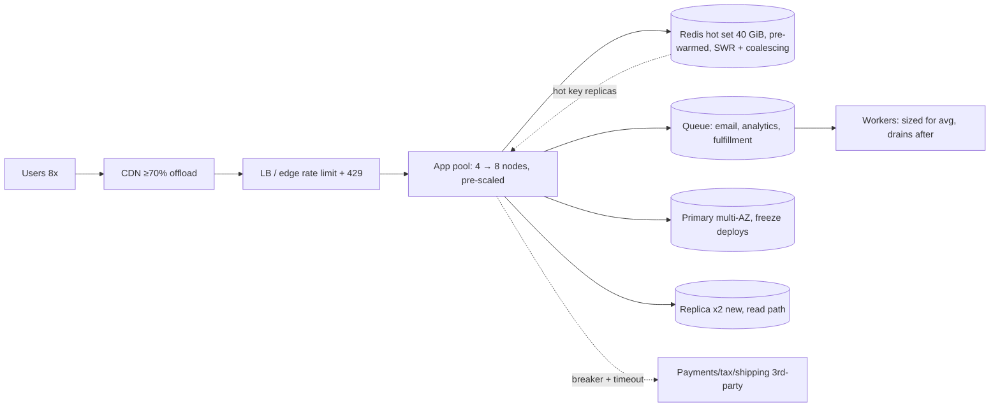

# Capacity Plan: Black Friday (~8x for 6 hours)

**Date:** 2026-09-04 · **Status:** Draft for review · **Owner:** TBD

```
mode: design (capacity plan) · tier: 2→3 (worked example, parameterized) · inputs: none read (no codebase given)
assumptions: (1) peak = 8x baseline AVERAGE traffic for 6h; (2) baseline = 1M DAU, 80 reads + 8 writes/user/day (e-commerce shape, 10:1 read:write); (3) stateless app tier in front of a single-primary SQL DB with read replicas. All three are falsifiable — plug your real baseline into the formulas in §1 and the shape of the plan holds until assumption 3 breaks.
producing: this capacity plan + degradation ladder + event-day runbook
```

## 0. Non-goals

- No re-architecture, no sharding, no multi-region for this event (see §7 evolution).
- No capacity plan for >8x: if forecast exceeds 10x, this plan is void — re-run the math.
- No guarantee of p99 latency SLO at peak for non-critical journeys (recommendations, reviews) — those are on the shedding ladder.
- Data-platform/analytics peak load is out of scope; analytics is shed first.

## 1. The numbers (Gate 1)

Formulas first — recompute with your real baseline:

- `peak QPS = 8 × baseline avg QPS` (peak during 6h window)
- `provisioned capacity = peak QPS × 1.4` (headroom for autocorrelated bursts, retries, forecast error)
- `in-flight = peak QPS × p99 latency` (Little's Law) → sizes thread pools, DB connections, LB queues

Worked example (`botec.py full --dau 1000000 --reads-per-user 80 --writes-per-user 8 --read-size 25000 --write-size 1000 --peak-factor 8`):

```
Capacity worksheet
  DAU                                1,000,000
  Read events/day                    80,000,000
  Write events/day                   8,000,000
  Read:write ratio                   10:1

  Read QPS avg / peak                925.9 / 7,407.4
  Write QPS avg / peak               92.6 / 740.7
  Read bandwidth avg / peak          185.19 Mbit/s / 1.48 Gbit/s

  Storage/day (x3 replication)       22.35 GiB
  Hot-set cache (20% of daily writes) 37.25 GiB

  App nodes @ 2,000 RPS/node         4 (min 2 for HA)
  In-flight requests at peak (Little) 1,481 (= peak QPS x 200 ms p99)
```

**What these numbers force:**

| Decision | Number behind it |
|---|---|
| Pre-provision app tier to ~10,400 RPS (≈6-8 nodes, was 4) | 8,150 QPS peak × 1.4 ≈ 11,400 RPS capacity; nodes give ~2,000 RPS each |
| 2 extra read replicas live before the event | 7,400 read QPS peak vs 5-10k QPS/replica ceiling — one replica is zero headroom |
| Hot set ≥ 40 GiB cache, pre-warmed | 37.25 GiB hot set; at 8x a 60% hit ratio means ~4,400 misses/s hitting origin |
| Queue + async everything non-sync | 740 write QPS is fine for the primary (1-5k writes/s ceiling) — reads, not writes, are the DB risk |
| DB connection pool ≈ 2,000-3,000 | Little's Law: 1,481-2,900 in-flight × pooler; app-node count × pool size must fit |
| CDN offload target ≥ 70% of GET bytes | 1.48 Gbit/s peak egress; origin egress at 8x is the silent bill (§5) |

The 6-hour duration is the key constraint: **autoscaling alone cannot save you** (warm-up lag minutes to tens of minutes, cold caches, image pulls). Pre-provision the peak; use the autoscaler only as above-forecast backstop.

## 2. Per-tier plan



**Edge/CDN.** Every point of hit ratio is origin capacity bought at the cheapest price. Cacheable GETs (product pages, category, assets) get long TTLs starting the week before. Cost: stale content risk — controlled via targeted purges on price/inventory changes.

**App tier.** Stateless; sessions externalized. Scale 4 → 8 nodes ~24h before (choice: pre-provision because autoscaler warm-up lag exceeds our 30-min forecast granularity; cost ≈ 2 extra node-days, trivial). Autoscale group max = 12 (above-forecast backstop).

**Cache.** Pre-warm top-sellers and deal-page payloads the morning of. Enable stale-while-revalidate and request coalescing (single-flight) so an expiry never becomes a stampede. TTLs raised 2-5x for the window. Trade-off: staleness on inventory counts — mitigate with short-TTL inventory served from a dedicated cheap path.

**Database.** The tier that cannot be scaled at 18:00 Thursday. Pre-scale: +2 read replicas, connection pooler sized for peak in-flight (~2,500), verify every hot query is index-backed at 8x (a 40 ms seq scan at 1x is a 320 ms disaster at 8x — and a connection pileup). Freeze schema migrations and deploys for the window. Write path (740 QPS) is comfortably inside the 1-5k/s primary ceiling — do **not** buy a bigger primary for this event.

**Async/queues.** Email, analytics events, recommendation refresh, order-fulfillment fanout move off the request path permanently for the event. Queue absorbs write bursts; consumers sized for baseline (backlog drains after the window; alert at 30-min lag).

**Third parties.** Payments, tax, shipping-rate APIs are the most common 8x ceiling. Confirm their rate limits in writing, cache shipping/tax quotes, wrap each in a 2s timeout + circuit breaker with a cached/default fallback.

## 3. Timeline / runbook

| When | Action |
|---|---|
| T-2 weeks | Load test at 11-12x (1.4x over forecast) in prod-like env; fix the top 3 bottlenecks it finds; confirm third-party limits |
| T-1 week | Pre-scale DB replicas and storage quotas; raise CDN TTLs; verify shedding ladder feature flags actually work (fire them) |
| T-1 day | Scale app pool to peak count; pre-warm cache; freeze deploys + migrations; pager rotation staffed; war room channel open |
| T-0 (6h window) | Dashboards: RPS vs capacity, cache hit ratio, replica lag, queue depth, breaker states, 429 rate; kill switch = shed to 70% capacity manually (metastable-failure antidote) |
| T+1 hour after | Ramp down autoscale max, unfreeze deploys, drain queue, retro within 48h |

**Degradation ladder (shedding order, enforced by edge + feature flags):**
1. Analytics/batch traffic (always safe) → 2. Recommendations/personalization → 3. Search facets → 4. Reviews/UGC → 5. Non-critical writes to queue-only → **never shed:** cart, checkout, payment.

## 4. Failure-mode walk (Gate 2, all 12)

| # | Injection | Verdict | Mechanism | Residual risk |
|---|---|---|---|---|
| 1 | Dependency down (payment API) | Degrade | 2s timeout + circuit breaker; orders queue for retry; browsing unaffected | Checkout conversion drop during breaker-open |
| 2 | 10x spike (8x + retries) | Degrade | CDN offload, pre-scaled pool to 11.4k RPS, shedding ladder, autoscale backstop | If >11.4k RPS sustained, non-critical journeys 429 |
| 3 | Hot key (deal-of-the-day) | Survive | L1 in-process cache + replicated hot entries; coalescing | First-miss burst on cold key; pre-warm covers known deals |
| 4 | Cache stampede | Survive | Single-flight rebuild + stale-while-revalidate + probabilistic early refresh; cache pre-warmed, no flush planned | Cluster restart mid-event: stale-serve keeps origin <50% |
| 5 | Retry storm | Degrade | Backoff + full jitter, retry budget 10%, edge returns 429 + Retry-After | Bounded ~1.3x multiplier, monitored |
| 6 | Partition/split-brain | Survive | Single-writer primary, managed multi-AZ failover (quorum); no app-level leaders | 30-60s write blip during failover |
| 7 | Poison message | Survive | DLQ after 3 attempts + alert; schema validation at ingest | One wedge alerts, manual requeue |
| 8 | Slow consumer / backlog | Degrade | Bounded queue backpressure; consumers autoscale; lag alert at 10 min, SLO 30 min | Fulfillment freshness degrades, visible |
| 9 | Region loss | Die (accepted) | Multi-AZ only for this event; backups in 2nd region, restore tested T-1wk; RTO 30-60 min via DNS failover to static page | Accepted risk with tripwire: revenue/hr vs multi-region cost (§7) |
| 10 | Clock skew | Survive | No wall-clock ordering on inventory (DB sequences); NTP drift monitored | — |
| 11 | Cascading failure | Degrade | Per-dependency timeouts (read-path budget <1s), bulkheaded pools, breakers, edge sheds before pools exhaust | Breaker flapping under marginal upstream |
| 12 | Metastable failure | Degrade | Manual kill switch sheds to 70% capacity to break the miss→slow→retry cycle; caches warm; retry rate-limit | Requires human in loop within ~5 min; war room covers |

## 5. Cost (Gate 4, approximate — verify current pricing)

**Baseline steady-state bill: ≈ $1,200-2,500 per month** (4 app nodes ~$140 each on-demand or ~$50 reserved, managed Postgres primary + 1 replica $250-750, cache $60-160, CDN ~1.5 TB/mo $20-120, LB ~$30) — the surge rides on top of this.

| Item | Surge cost (event) | Note |
|---|---|---|
| App nodes 4→8 for ~3 days | ~$40-100 | ~$3-5/node/day on-demand |
| 2 extra read replicas, 3 days | ~$20-50 | $100-250/mo each, prorated; keep if peak recurs |
| Cache upsized for 40 GiB hot set | ~$10-30 | Prorated |
| CDN egress ~3-4 TB over window | ~$40-300 | $0.01-0.08/GB; same bytes from origin ≈ 5-10x |
| LB + queue + misc | ~$20-50 | |
| **Total surge** | **≈ $150-550 one-off** | ~2% of a bad Black Friday hour |

Event window serves ≈176M requests (6h × 8,150 QPS) → **≈ $0.001-0.003 per 1k requests** marginal surge cost. Top levers: CDN hit ratio (every 10% = ~150 RPS off origin) and not upsizing the primary (write headroom already 1.3-6.7x).

## 6. Right-sizing (Gate 3)

Tier 2→3. Justified above-tier: 2 extra replicas (read ceiling math, §1), pre-provisioning instead of autoscale (6h duration). Rejected for this event: multi-region (region loss accepted, §4.9), sharding (write QPS 740 « 1-5k ceiling), new queue tech (existing queue + DLQ suffices), bigger primary (writes not the constraint).

## 7. Evolution — what breaks first at 10x

- Peak 80k QPS: CDN/cache offload ratio becomes the entire architecture; app tier needs autoscale on minute-granularity + pre-baked images.
- DB reads exceed replica fleet: dedicated search/caching layer for product reads; consider CQRS read store.
- If forecast repeatedly exceeds 12x or an outage hour costs more than a year of multi-region, active-passive DR stops being an accepted risk.
- 5-yr storage (≈40 TiB) forces partitioning/tiering decisions within ~18 months — schedule that review, not this event.
