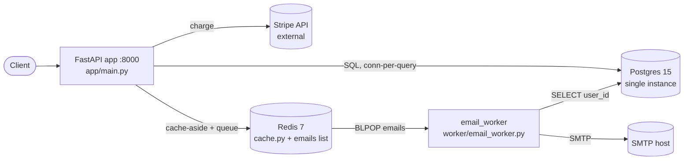

> Real output, not a mockup. This document was produced end-to-end by the skill (eval run, iteration 1 — see evals/README.md). Published verbatim; only this note was added.

# Architecture (as-is) — shop-api

Date: 2026-08-30 | Codebase state: working tree at `demo-app/`

## Summary

`shop-api` is a small e-commerce backend that creates orders, reads them, and charges cards via Stripe, with a background worker sending confirmation emails. It is a single FastAPI process plus one worker, backed by one Postgres and one Redis, wired together with `docker-compose` (`docker-compose.yml`). No scale metrics or traffic data exist in the repo (no metrics/logging libs found), so real load is **unknown** — but the code shape is a single-node demo, not a production-hardened service.

## Container diagram



The app talks to Stripe **synchronously on the user's request** (`app/main.py:46`), uses Redis for *both* cache-aside (`app/cache.py`) and as the email job queue (`app/main.py:56-57`), and the worker consumes that queue (`worker/email_worker.py:23`). All app<->store hops are in-process function calls; app<->worker is the only async hop (through the Redis list).

## Component inventory

| Component | Location | Technology | Role |
|---|---|---|---|
| API service | `app/main.py` | FastAPI 0.104 + uvicorn | HTTP entry: create/read/charge orders |
| DB access | `app/db.py` | psycopg2 (raw SQL) | Order + payment persistence |
| Cache | `app/cache.py` | Redis 5 client | Cache-aside for order reads, 10-min TTL |
| Payments | `app/payments.py` | `requests` -> Stripe | Charge card via Stripe REST |
| Domain model | `app/models.py` | plain dicts, no ORM | Compute order total |
| Email worker | `worker/email_worker.py` | Redis BLPOP + smtplib | Send confirmation emails |
| Database | `docker-compose.yml:23` | Postgres 15, single | System of record |
| Cache/queue | `docker-compose.yml:29` | Redis 7, single | Cache **and** message queue |
| Schema | `migrations/001_init.sql` + `app/db.py:7` | raw SQL, applied on startup | No migration tool |

## Request flows

### Read: `GET /orders/{id}` (`app/main.py:29`)
1. `cache.get_order_cached(id)` — Redis GET `order:{id}` (`app/cache.py:13`)
2. miss -> `db.get_order(id)` — new Postgres connection, SELECT, close (`app/db.py:51`)
3. `cache.put_order_cached(order)` — Redis SET, 600s TTL (`app/cache.py:20`)

### Write (money path): `POST /orders/{id}/charge` (`app/main.py:40`)
1. `db.get_order(id)` (`app/main.py:42`)
2. `payments.charge(total, id)` — **synchronous HTTP POST to Stripe, no timeout** (`app/payments.py:14`)
3. `db.insert_payment(...)` — separate connection/txn (`app/main.py:47`)
4. `db.update_order_status(id, "paid")` — separate connection/txn (`app/main.py:48`)
5. `r.lpush("emails", ...)` — enqueue email job (`app/main.py:56`)

Steps 2–5 are **four independent, non-atomic side effects** with no idempotency key. A crash or retry between any two leaves the system inconsistent (details in Risk register R1).

### Async: email worker (`worker/email_worker.py:21`)
`BLPOP emails` (job removed from queue *before* processing) -> new Postgres connection -> SELECT user_id -> SMTP send -> `sleep(0.1)`. No ack, no retry, no dead-letter.

## Data stores

| Store | Writers | Readers | Source of truth? | Consistency mechanism |
|---|---|---|---|---|
| Postgres `orders` | `db.insert_order`, `db.update_order_status` | `db.get_order`, worker | Yes | Single primary; no replica |
| Postgres `payments` | `db.insert_payment` | none in code | Yes | Single primary |
| Redis `order:{id}` | `cache.put_order_cached` | `cache.get_order_cached` | No (mirror of DB) | **TTL only (600s) — never invalidated on status change** |
| Redis `emails` list | `main.charge_order` | `email_worker` | No (transient) | None — no persistence guarantee, no ack, no DLQ |

## Infrastructure & delivery

- **Deploy**: `docker-compose up` — single `app`, single `worker`, single `db`, single `cache`. No load balancer, no replicas, no orchestrator, single AZ/host.
- **Config/secrets**: env vars; `STRIPE_SECRET_KEY` passed through compose (`docker-compose.yml:10`). `.env.example` ships a **`sk_live_` placeholder** (`.env.example:3`) and DB creds are hardcoded `shop:shop`.
- **Migrations**: DDL runs on app startup (`app/db.py:30`); `migrations/001_init.sql` is manual, `IF NOT EXISTS`, **no down-migrations, no migration tool**.
- **Observability**: **none found** — no metrics, no structured logging, no tracing, no health/alerting. No one can see this system fail until a customer complains.

## Capacity reality check

Back-of-envelope at an assumed 20k DAU (5 reads + 1 write per user, peak x5):

```
Read QPS avg/peak    1.2 / 5.8
Write QPS avg/peak   0.2 / 1.2
Storage over 5 yr    ~104 GiB
```

**The traffic is trivial** — single-digit QPS. This system will not fall over from load at any realistic near-term scale. That reframes the worry: **"won't hold up" is not a scaling problem here, it's a reliability and correctness problem on the payment path.** Right-sizing verdict: the single-node topology is *appropriate* for the tier; the problem is missing failure handling, not missing horsepower.

## Risk register

| # | Risk | Evidence | Severity | First fix |
|---|---|---|---|---|
| R1 | **Non-atomic charge = double-charge / lost payment.** Stripe charge, payment insert, status update, and enqueue are 4 separate steps with no idempotency key. Crash/retry after Stripe returns but before DB commit charges the card while the order stays unpaid; a client retry charges again. | `app/main.py:40-57` | **S1** | Send an idempotency key to Stripe; wrap payment insert + status update in one DB transaction; make the endpoint idempotent (dedup on order_id/key). |
| R2 | **No timeout on Stripe call -> cascading hang.** `requests` has no default timeout (comment admits it). A slow Stripe holds the request thread indefinitely; uvicorn's worker pool exhausts and the whole API — including reads — stops responding. | `app/payments.py:1-19` | **S1** | Add `timeout=(3, 10)`; add retry-with-backoff + circuit breaker; fail fast with 503. |
| R3 | **Redis is a single point of failure for cache AND queue, with a lossy queue.** `BLPOP` removes the job before it's processed and there's no ack/retry/DLQ; a worker crash or Redis restart silently drops confirmation emails. | `app/main.py:56`, `worker/email_worker.py:23`, `docker-compose.yml:29` | **S1** | Use a durable queue or a transactional outbox in Postgres; process-then-ack; add a dead-letter path and retry. |
| R4 | **Single Postgres, no replica, no backup, weak creds.** One instance; region/AZ/disk loss = total data + payment-record loss. Creds are `shop:shop`. | `docker-compose.yml:23-28` | **S1** | Managed Postgres with automated backups + tested restore; a read replica; real secrets. |
| R5 | **Connection-per-query, no pool.** Every query opens and closes a psycopg2 connection. Even at low QPS this churns connections and will exhaust `max_connections` under any burst or slow query. | `app/db.py:26-27` (called per fn) | **S2** | Add a connection pool (`psycopg2.pool` / pgbouncer). |
| R6 | **Cache never invalidated on write.** `update_order_status` sets status to `paid` but does not touch Redis; `GET /orders/{id}` can return `created` for up to 10 minutes after payment. | `app/main.py:48` vs `app/cache.py:21` | **S2** | Invalidate/refresh `order:{id}` on every status change (or write-through). |
| R7 | **No observability.** No metrics, structured logs, traces, or alerts anywhere. Failures are invisible until customers report them. | whole repo (no libs in `requirements.txt`) | **S2** | Add structured logging + basic RED metrics + error alerting. |
| R8 | **Schema applied at app startup, no migration tool.** Concurrent app instances racing DDL; no rollback path; drift between `migrations/001_init.sql` and `db.py` DDL. | `app/db.py:30`, `migrations/001_init.sql:1` | **S2** | Adopt a migration tool (Alembic); run migrations as a deploy step, not app startup. |
| R9 | **Live-key pattern in repo + secret via compose env.** `.env.example` uses `sk_live_...`; secrets visible in process env. | `.env.example:3`, `docker-compose.yml:10` | **S2** | Use a test key in examples; inject secrets via a secret manager. |
| R10 | **No horizontal scale / no LB.** Single app container is a SPOF; a crash or deploy = full outage. | `docker-compose.yml:3-13` | **S3** (given current traffic) | Run 2+ app instances behind a load balancer when uptime matters. |

## Failure-mode walk (the 12 injections)

| Injection | Behavior | Why (evidence) |
|---|---|---|
| 1. Dependency down (Stripe/DB/Redis) | **Die** | No timeouts/breakers (R2); reads also die when Redis is down (`cache.py` at import). |
| 2. 10x spike | **Degrade->die** | Traffic is tiny, but connection-per-query (R5) exhausts Postgres before CPU matters. |
| 3. Hot key | Survive (N/A at this scale) | Single-digit QPS. |
| 4. Cache stampede | **Degrade** | Empty Redis sends all reads to single Postgres, no single-flight (R5+R4). |
| 5. Retry storm | **Die (money)** | Retries re-charge cards — no idempotency (R1). |
| 6. Partition/split-brain | N/A | Single primary, no consensus. |
| 7. Poison message | **Degrade/loss** | No DLQ; a job whose order row is gone crashes the worker loop (`email_worker.py:31`). |
| 8. Slow consumer / backlog | **Degrade silently** | Unbounded Redis list, no lag alert (R3, R7). |
| 9. Region loss | **Die (data loss)** | Single instance, no backup/replica (R4). |
| 10. Clock skew | N/A | No wall-clock ordering logic. |
| 11. Cascading failure | **Die** | Slow Stripe -> thread pool exhaustion -> API down (R2). |
| 12. Metastable failure | **Degrade** | Cold cache + connection churn can keep DB saturated after a spike clears (R5). |

## Not read / unknown

- No tests, Dockerfile, or CI config present in the tree — build/deploy pipeline unknown.
- No real traffic/scale numbers — capacity section uses a **stated assumption** (20k DAU), not measured data.
- Stripe integration details (webhooks, refunds, reconciliation) not present; only the charge call exists.
- Auth/authorization: none visible on any endpoint — noted as an open question, not audited here.

## Highest-leverage next steps (in order)

1. **R1 + R2**: idempotency + transaction + Stripe timeout. This is the money path; fix it first.
2. **R3**: move the email queue to a durable outbox or real broker with retry/DLQ.
3. **R4**: managed Postgres with tested backups.
4. **R5, R6, R7**: connection pool, cache invalidation, basic observability.
