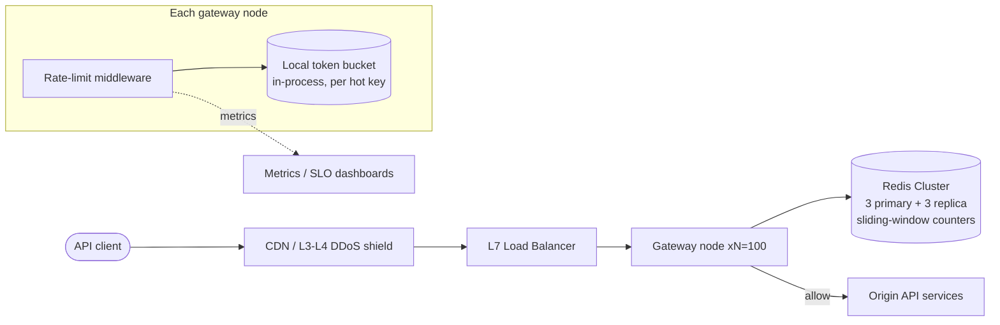

> Real output, not a mockup. This document was produced end-to-end by the skill (eval run, iteration 1 — see evals/README.md). Published verbatim; only this note was added.

# Design: Distributed Rate Limiter (public API, 100 gateway nodes)
Date: 2026-08-30 | Status: draft | Author: system-design skill

## Context
We run a public API served by 100 gateway nodes behind an L7 load balancer.
We need to enforce request rate limits per API key / IP / plan tier so that no
single client can degrade the service for others, and so the origin services
behind the gateway are protected from floods. The limiter must be consistent
enough to be fair across all 100 nodes (a client hitting node 7 and node 42
must share one budget) while adding minimal latency to every request. This is
classic problem #2 (rate limiter): the algorithm is a solved menu; the real
work is the *distributed state* and the *fail mode*.

## Requirements

### Functional
- **Decide allow/deny** for each incoming API request against one or more limits.
- **Enforce per-key limits** (per API key, per source IP, per plan tier) *and* a
  global safety limit protecting the origin.
- **Signal the client**: return `429 Too Many Requests` + `Retry-After` and
  `RateLimit-*` headers so well-behaved clients self-throttle.

### Non-functional
- **Scale (from botec):** avg ~200k check-QPS, **peak ~500k check-QPS**
  (100 nodes × ~5k RPS/node); ~2M distinct rate-limit keys/day. Counter state
  ~200 MiB total (tiny).
- **Latency:** the limiter adds to *every* API call, so budget it hard —
  **p99 added latency < 2 ms**. A same-DC Redis round trip is 0.2–1 ms
  (`references/numbers.md`); one hop is affordable, a cross-region hop
  (≥70 ms) is not — the limiter state stays region-local.
- **Availability:** the limiter must not be less available than the API it
  fronts. Target the limiter data plane at **99.99%** (multi-AZ). It must
  **fail open** (see deep dive) so a limiter outage never takes the API down.
- **Consistency:** *approximate* counting is acceptable. A few percent of
  over-admission at window boundaries is fine; hard financial correctness is
  not a requirement. This choice unlocks cheap, fast designs.

### Non-goals
- Not a WAF / bot-detection / DDoS-scrubbing system (that lives at the edge/CDN
  in front of us; volumetric L3/L4 attacks are shed before reaching gateways).
- Not billing/metering of record (usage billing has its own exact ledger).
- No cross-region *global* single budget at launch — limits are enforced
  per-region; a client hitting two regions may get up to 2× its limit (noted).
- No per-endpoint fine-grained cost weighting in v1 (all requests cost 1 token);
  weighting is an easy evolution.

## Assumptions & estimates

botec.py output (`references/numbers.md` constants):

```
=== QPS (avg 200k RPS => 17.28B events/day) ===
  QPS avg                            200,000
  QPS peak (x2.5, stated)            ~500,000

=== Redis nodes for 500k peak check-QPS (150k ops/s/node) ===
  Servers for peak                   4
  With N+2 redundancy                6

=== Counter memory: 2M keys/day, ~100 B/counter ===
  Hot set (20% of keys)              ~38 MiB
  Total state                        ~200 MiB   Single Redis node fits? yes
```

Assumptions (falsifiable):
- 100 gateway nodes, ~5k RPS/node at peak (verify against LB metrics).
- ~2M distinct keys/day; each counter ≈ 2 window buckets × ~50 B ≈ 100 B.
- Traffic is load-balanced (not sticky) → each node sees ~1/100 of any one
  key's requests on average. **This is the crux**: a purely local limiter can't
  be accurate without a shared view.

Decisions the numbers force:
- **State is trivially small (~200 MiB) → this is NOT a storage/sharding
  problem.** It is a *throughput + latency + availability* problem.
- **500k check-QPS → a shared store is viable but load-bearing.** A single
  Redis node (100k–1M ops/s) could technically serve it, but we run a small
  **Redis Cluster (3 primaries + 3 replicas, 6 nodes)** for HA and headroom,
  justified directly by the 500k peak number.
- **Limiter is on every request path → +1 ms is acceptable, +70 ms is not.**
  State is region-local; no cross-region hop on the check path.

## High-level design

### API surface (limiter is internal middleware in each gateway)
Internal contract, called once per request by gateway middleware:
- `check(key, limit, window) -> {allowed: bool, remaining: int, reset_at: ts, retry_after: s}`

Client-facing behavior added by the gateway:
- On allow: pass through, add headers
  `RateLimit-Limit`, `RateLimit-Remaining`, `RateLimit-Reset` (IETF draft).
- On deny: `HTTP 429` + `Retry-After: <seconds>` + same headers.

### Data model (Redis)
- Key: `rl:{scope}:{id}:{window_start}` e.g. `rl:key:ak_1a2b:1735689600`.
- Value: integer counter (INCR), `EXPIRE` = 2× window so the previous bucket is
  available for the sliding-window weighting.
- Everything is derived and ephemeral; **Redis is not a source of truth**, it is
  a shared approximate counter. No persistence required (RDB/AOF off is fine;
  a cold restart just resets counts, which fails safe).

### Algorithm: sliding-window counter (the skill default)
For key `k`, window `W` (e.g. 60 s), limit `L`:
```
count = current_bucket_count
      + prev_bucket_count * (fraction of W still overlapped by the sliding window)
allow if count < L
```
Chosen over alternatives (`references/components.md`):
- **Fixed window** — cheap but allows a 2× burst across the boundary. Rejected.
- **Sliding log** (store every timestamp) — exact but O(requests) memory; at
  500k QPS that's a memory bomb. Rejected.
- **Token bucket** — great for *burst + steady rate*; we keep it as the
  *local* layer (below). The global layer uses sliding-window counter for
  smooth, fair enforcement with ~O(2) integers of memory per key.

### Diagram



### Write path = read path (rate check), walked end to end
1. Request arrives at gateway node; middleware runs **before auth-heavy work**
   but resolves identity cheaply (API key from header, or source IP).
   *(Rate limit unauthenticated floods by IP first, then by key after auth —
   `references/components.md` mistake #1.)*
2. Middleware checks its **local token bucket** for that key (in-process,
   lock-free). If local tokens remain, decrement and **allow immediately —
   zero network hops**. Local buckets are refilled by leases from Redis.
3. If the local lease is exhausted (or absent), call **Redis** with an
   **atomic Lua script**: it computes the sliding-window count, and if under
   limit, increments and returns a fresh lease of N tokens for local use.
   One round trip, ~0.5 ms.
4. Decision returned; gateway adds `RateLimit-*` headers. On deny → `429 +
   Retry-After`. On allow → forward to origin.

The Lua script makes the count-and-increment **atomic** (no read-modify-write
race across 100 nodes) — this is what makes it correct under concurrency.

## Deep dives

### 1. Distributed state: centralized Redis vs local-only vs two-tier (the core decision)

The tension: 100 non-sticky nodes each see ~1/100 of a key's traffic.

| Option | How | Cost |
|---|---|---|
| **Local-only** (per node) | Each node enforces `L/100` locally, no shared state | Zero latency, zero SPOF — but *wrong*: skewed/bursty clients hit few nodes and either get throttled at 1/100 (too strict) or, if you don't divide, get up to 100×L (too loose). Rejected as primary. |
| **Centralized Redis** (every request) | Atomic Lua sliding-window on every check | Accurate & simple. Cost: +0.5 ms/request and 500k ops/s of Redis load; Redis is now on the critical path. |
| **Two-tier (chosen)** | Redis is authority; each node holds a **short lease of tokens** per hot key and serves most decisions locally, refilling from Redis in batches | Cuts Redis QPS by the lease size (e.g. lease 10 → ~50k ops/s) and hides latency for hot keys. Cost: bounded over-admission of up to `nodes × lease_tokens` per window in the worst case, and lease-return complexity. |

**Choice: centralized Redis sliding-window counter as the authority, with a
thin local token-lease layer in front.** Because: accuracy requires shared
state at 100 nodes (local-only is provably wrong for skewed traffic); the
local lease layer buys back the latency and Redis-load that pure-centralized
costs. **Cost:** small, *bounded* over-admission (tune lease size down for
low-limit keys, up for high-limit keys — a whale API key with limit 1M/min can
lease 1000 tokens and rarely touch Redis; a free key with limit 60/min leases
1–2 and stays essentially exact). **Revisit when:** peak check-QPS exceeds
~1M (shard Redis further) or a single global cross-region budget becomes a
product requirement.

*Ship order:* v1 can launch **centralized-only** (500k ops/s fits the 6-node
cluster) — it is simpler and correct. Add the local lease layer as the first
optimization once Redis latency or cost shows up in dashboards. This keeps us
right-sized (don't build the two-tier optimization before a number demands it).

### 2. Fail-open vs fail-closed on limiter outage (a product decision, made explicit)

If Redis is unreachable and the local lease is empty, the middleware must
decide. `references/components.md`: this is a product call.

**Choice: fail OPEN, with a local backstop.** For a *public API*, availability
beats perfect abuse-prevention: a limiter outage must never return 429 to
legitimate traffic. On Redis failure each node falls back to its **local
token bucket sized at `L/100 × safety_factor`** so we still cap the absolute
worst case (protecting the origin) without a shared view. **Cost:** during a
Redis outage a determined attacker concentrating on one node could exceed
their fair share; acceptable because (a) it's time-bounded, (b) the origin is
still protected by the global per-node cap, (c) the edge DDoS shield handles
volumetric abuse. **Revisit when:** the API starts fronting a resource where
over-admission is expensive (then fail-closed for that route class only).

### 3. Per-tenant fairness and the global cap

- Enforce a **hierarchy** in one check: per-IP (anti-flood) → per-API-key
  (fairness) → per-plan-tier → **global origin-protection cap**. First limit
  to trip wins; return the tightest `Retry-After`.
- The global cap is a single hot Redis key (500k INCR/s on one key). Mitigate
  the hot-key with **key-salting**: shard the global counter into 16 sub-counters
  `rl:global:{0..15}`, each node hits one by hash, and the limit is `L/16` per
  shard (`references/stress-tests.md` #3 antidote). Or enforce the global cap
  purely via summed local leases — cheaper and adequate for origin protection.

## Failure modes (12 injections walked)

| # | Injection | Behavior | Mechanism | Residual risk |
|---|---|---|---|---|
| 1 | Redis (dependency) down | **Degrade** — limiter fails open; local token buckets (`L/100`) still cap per node | Per-call timeout 5 ms → fallback to local bucket; circuit breaker stops hammering Redis | A focused attacker on one node exceeds fair share until Redis returns |
| 2 | 10× traffic spike | **Survive** — limiter *is* the shedding mechanism; excess gets 429 + Retry-After | Local leases absorb most decisions; Redis load capped by lease batching | If spike is all-new keys (no leases), Redis QPS jumps — cluster has N+2 headroom |
| 3 | Hot key (one whale key / global counter) | **Survive** — whale key uses large local leases (rarely hits Redis); global counter salted into 16 shards | Local token-lease per key; key-salting on the global counter | Salting loosens global cap precision by ~1/16 |
| 4 | Cache stampede (Redis restarts empty) | **Survive/degrade** — empty counters = everyone allowed briefly (fails safe, not a thundering DB); no origin store behind it to stampede | No persistence needed; counters rebuild in one window | Brief over-admission window (≤ one window length) after cold restart |
| 5 | Retry storm (429'd clients retry) | **Degrade→survive** — `Retry-After` tells clients when to come back; retries that ignore it are cheaply 429'd again (local bucket, no Redis hop) | 429 + Retry-After contract; deny path is local & cheap | Misbehaving clients ignoring Retry-After add constant 429 load (still cheap) |
| 6 | Network partition / split-brain | **Degrade** — minority nodes that can't reach their Redis primary fail open locally; no two-leader corruption because counters are additive, not authoritative writes | Redis Cluster majority quorum for failover; counters are commutative (INCR) | Each partition side counts independently → temporary over-admission |
| 7 | Poison message | **N/A** — no queue/consumer in the check path; malformed requests are just rejected/counted | Input validation at gateway | — |
| 8 | Slow consumer / backlog | **N/A** — synchronous decision, no async backlog to grow | — | — |
| 9 | Region loss | **Survive (per-region)** — each region has its own Redis; losing one region loses its limiter state with its traffic. Global LB reroutes; surviving region enforces its own limits | Region-local Redis; DNS/global LB failover | Cross-region clients may briefly get up to 2× limit during failover (accepted non-goal) |
| 10 | Clock skew | **Survive** — window boundaries use Redis server time (single clock via `TIME`/`EXPIRE`), not the 100 gateway wall-clocks | Bucket timestamps derived from Redis, not node clocks; TTLs are relative | Small gateway/Redis skew only affects lease refill timing, self-correcting |
| 11 | Cascading failure | **Survive** — aggressive 5 ms Redis timeout + circuit breaker + bulkhead means a slow Redis can't pile up gateway threads; limiter fails open fast | Timeout budget « API SLO; per-dependency bulkhead; breaker | Fail-open during the breaker-open window (bounded) |
| 12 | Metastable failure | **Survive** — limiter has no self-amplifying miss→retry loop; on Redis recovery, breaker half-opens gradually so 100 nodes don't stampede it at once | Half-open breaker with jittered recovery; local leases keep serving during drain | If all leases expire simultaneously post-recovery, a Redis micro-spike — jitter lease TTLs to smooth |

## Right-sizing & cost

- **Tier: 3 (Scale).** 500k peak check-QPS / 100-node public API is squarely
  tier-3 (`references/cost.md`, 500k–5M users/day shape). A dedicated Redis
  Cluster and idempotent, region-local design are tier-appropriate — **not**
  scale theater.
- **Above-tier check:** No Kafka, no microservice for the limiter (it's
  in-process middleware), no multi-region *writes*. The only non-trivial
  component, the 6-node Redis Cluster, is justified directly by the 500k
  check-QPS + HA number. Cross-region global budget is explicitly deferred.
- **Estimated monthly cost (approximate — verify current pricing):**

| Item | Qty | Rough $/mo |
|---|---|---|
| Managed Redis nodes (r6g.large-class, multi-AZ) | 6 | $150–300 ea → **$0.9k–1.8k** |
| Cross-AZ traffic for check hops (tiny payloads, batched by leases) | — | **$100–400** |
| Gateway nodes | (already exist) | $0 incremental |
| Metrics/dashboards | shared | ~$50 |
| **Total** | | **~$1.1k–2.3k/mo** |

- **Cost per 1k requests:** ~$2k/mo ÷ ~518B requests/mo ≈ **$0.000004 / 1k
  requests** — negligible; the limiter is essentially free per request. The two
  cost levers are (a) local leases cut Redis node count, (b) cross-AZ traffic
  (keep Redis and gateways AZ-affine where possible).

## Evolution
- **Breaks first at 10× (5M peak check-QPS):** the Redis Cluster / hot global
  counter. Fix: rely more heavily on the **local lease layer** (larger leases,
  fewer Redis hops), shard Redis further, and salt hot keys more aggressively.
- **Next architecture step:** move fully to **approximate local counting with
  periodic gossip/async sync** to Redis (the "in-process + async sync" option
  in `references/components.md`) — trades a bit more accuracy for near-zero
  Redis dependency on the hot path.
- **When a single global cross-region budget is required:** introduce an
  async cross-region reconciliation of counts (CRDT-style additive counters,
  eventual) — accept that a *synchronous* global budget would add ≥70 ms and
  is incompatible with the latency SLO.
- **Tripwires to revisit:** Redis p99 check latency > 1 ms; Redis CPU > 60%;
  fail-open rate > 0.1% of requests/day; 429 rate spikes uncorrelated with
  known abuse; cross-AZ egress bill climbing.

## Open questions
- Confirm real peak RPS/node from LB metrics (drives Redis sizing). — owner: SRE
- Are any routes expensive enough to warrant **fail-closed** + weighted costs? — owner: API PM
- Is a single global cross-region limit a product/compliance need, or is
  per-region acceptable (current assumption)? — owner: Product
- Plan-tier limit table (free/pro/enterprise numbers) — owner: Product/Billing
