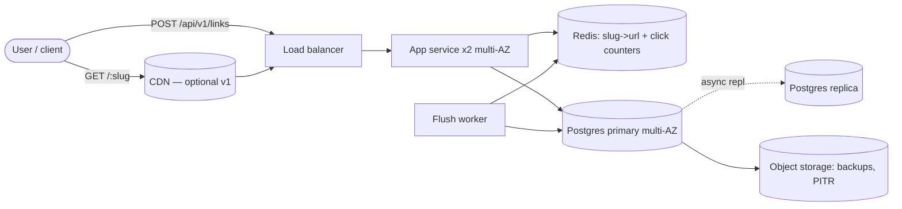

> Real output, not a mockup. This document was produced end-to-end by the skill (eval run, iteration 1 — see evals/README.md). Published verbatim; only this note was added.

# Design: URL Shortener
Date: 2026-08-30 | Status: draft | Author: opencode (system-design skill)

## Context

New product: a URL shortener. Users create short links and resolve them from anywhere — web, email, chat, SMS, printed media. The workload is stated up front: ~100M link resolutions per day and ~1M new links per day. This is a classic read-heavy (100:1) problem; the hard parts are ID generation, the cached read path, and abuse resistance — not storage, which is trivially small at this scale.

## Requirements

### Functional
- **Shorten**: `POST /api/v1/links {long_url}` -> `{slug, short_url}` (public API, no account required v1)
- **Redirect**: `GET /:slug` -> HTTP redirect to the long URL
- **View basic stats**: aggregated click counts per link (hourly/daily resolution; no per-click detail v1)

### Non-functional
- **Scale**: 100M resolutions/day (~1,157 avg / ~3,472 peak QPS), 1M new links/day (~12 avg / ~35 peak QPS), 100:1 read:write (botec output below)
- **Latency**: p99 redirect < 100 ms end-to-end (server-side budget: 50 ms). A cross-region hop costs >= 70 ms, so the read path is single-region.
- **Availability**: 99.9% on the redirect flow (8.76 h/yr downtime; 4.32 min error budget / 30 d) — normal SaaS default, multi-AZ
- **Consistency**: strong for redirects — a link a user just created must resolve immediately (cache miss reads the primary; no replica-lag path). Click counts are eventually consistent (loss window <= flush interval, flagged).
- **Durability**: a written link must never be lost (writes are small and cheap; acknowledge only after fsync-committed insert).

### Non-goals (v1)
- Custom/vanity aliases (slug length is a product question; see deep dive 1 — revisit trigger named)
- Link editing, expiry scheduling, soft/hard delete pipelines
- Accounts, auth, per-user dashboards (public API + optional `owner_id` column)
- Per-click raw analytics (referrer/geo/user-agent detail) — aggregated counters only
- Malicious-content scanning (URL validation only: scheme + length allowlist)
- Multi-region writes and geo-replication (single region + multi-AZ; evolution section)
- GDPR deletion pipeline, link ownership transfer

## Assumptions & estimates

Assumptions (falsifiable):
- 50M DAU resolve links, averaging 2 resolutions/day each (100M total). Peak factor 3x of average.
- Link record ~500 B (slug 11 char + long_url up to 2048 B avg ~200 B + owner_id + timestamps). URL record ~500 B per references/numbers.md.
- Redirect response ~500 B (headers + Location header).
- 5-year storage horizon, flat traffic growth, 3x replication.
- Click counter row ~100 B (slug + date + count).

`python scripts/botec.py full --dau 50000000 --reads-per-user 2 --writes-per-user 0.02 --read-size 500 --write-size 500 --peak-factor 3 --replication 3 --years 5 --per-server-rps 5000 --p99-latency-ms 50`

```
Capacity worksheet
  DAU                                50,000,000
  Read events/day                    100,000,000
  Write events/day                   1,000,000
  Read:write ratio                   100:1

  Read QPS avg / peak                1,157.4 / 3,472.2
  Write QPS avg / peak               11.6 / 34.7
  Read bandwidth avg / peak          4.63 Mbit/s / 13.89 Mbit/s

  Storage/day (x3 replication)       1.40 GiB
  Storage over 5 yr (growth x1/yr)   2.49 TiB
  Hot-set cache (20% of daily writes) 95.37 MiB

  App nodes @ 5,000 RPS/node         2 (min 2 for HA)
  In-flight requests at peak (Little) 174 (= peak QPS x 50 ms p99)

Decisions these numbers force:
  - no thresholds crossed: prefer the boring tier-appropriate design
```

Decisions the numbers force:
- **1,157 avg / 3,472 peak read QPS => cache is load-bearing for tail latency, but a single Redis node is plenty** (hot set ~3-15 GB, see below). No cache cluster, no CDN requirement at launch.
- **2.49 TiB / 5 yr (x3 replication) => single managed Postgres primary + replica is comfortably in scope** (relational default applies below ~5-10 TiB and ~5-10k write QPS). No sharding, no NoSQL.
- **12 write QPS => the write path is trivial**; the interesting write-side problems are ID uniqueness and abuse, not throughput.
- **4.6 Mbit/s avg read bandwidth => egress is small but not free**: ~1.5-3 TB/mo, the biggest recurring cost lever after the DB (see cost section).
- **174 in-flight requests at peak (Little's law) => connection pools sized for hundreds, not thousands; pool exhaustion is a self-inflicted failure mode.**

## High-level design

### API surface
| Endpoint | Behavior |
|---|---|
| `POST /api/v1/links` body `{long_url, owner_id?}` header `Idempotency-Key?` | 201 `{slug, short_url, long_url}`; 400 invalid URL; 429 rate-limited |
| `GET /:slug` | 302 `Location: <long_url>` (or 301 — product call, deep dive 2) |
| `GET /api/v1/links/:slug` | 200 link metadata (owner, created_at) |
| `GET /api/v1/links/:slug/stats` | 200 `{slug, clicks_total, clicks_by_day[]}` |

Redirects ride the bare domain (`GET /:slug`) so they are one DNS hop from the client; all control-plane calls use `/api/v1`.

### Data model
```
links(
  slug        char(11) PK,          -- base62 of Snowflake ID
  long_url    varchar(2048) NOT NULL,
  owner_id    uuid NULL,            -- optional attribution
  created_at  timestamptz NOT NULL DEFAULT now()
)
link_clicks(                          -- aggregated, written by flush worker
  slug        char(11),
  day         date,
  clicks      bigint NOT NULL,
  PRIMARY KEY (slug, day)
)
```
Access patterns: (1) `SELECT long_url FROM links WHERE slug = ?` — point read, PK, cache-forever; (2) `INSERT` on write — 12/s; (3) `UPSERT clicks` — 1M rows/day (~150 MB/day, ~270 GB / 5 yr). Indexes: PK only; clicks PK covers the stats query. No other indexes — there are no other queries v1.

### Diagram



### Walk-through

**Write path** (`POST /api/v1/links`): App validates URL (scheme `http/https`, length <= 2048), checks the app-local rate-limit bucket (per IP + per `owner_id`; token bucket in memory — at 12 w/s no shared state needed, Redis bucket when this becomes contested), generates a Snowflake ID and base62-encodes it to an 11-char slug, `INSERT` into Postgres (PK collision impossible by construction — no retry loop). With `Idempotency-Key`, the key is stored on the row (unique index) so retries return the same slug. 201 returns. ~12/s average, ~35/s peak — Postgres primary handles this trivially.

**Read path** (`GET /:slug`): App does `GET slug:<s>` in Redis (cache-aside). Hit -> increment the in-Redis click counter (`INCR clicks:<slug>:<date>`) and return 302. Miss -> `SELECT long_url FROM links WHERE slug = ?` against the **primary** (strong read-after-write for just-created links; miss rate ~1-2% so primary sees only ~15-70 QPS), populate cache with no expiry (slugs are immutable), then same counter increment and 302. p99 server budget: Redis hit 0.2-1 ms; worst-case miss 1-5 ms. Total well under the 50 ms server budget.

**Stats path**: the flush worker every 5 min drains `clicks:*:<today>` counters from Redis and `UPSERT`s them into `link_clicks`. Stats API reads `link_clicks` (sum over the last N days) — eventually consistent by design.

## Deep dives

### 1. ID generation — the actual hard problem

Options:
- **Random base62 (7 chars)**: 62^7 = 3.5T namespace, but birthday-bound collisions become likely at ~sqrt(3.5T) = ~1.9M links. We create 1.8B links in 5 years — collisions are **guaranteed**. Requires uniqueness check + retry per insert (extra round trip, nondeterministic write path). Rejected.
- **DB sequence / Postgres identity + base62 (7 chars)**: correct and simple at 12 w/s, but serializes all writers on one counter, reveals creation volume, and becomes a cross-service coupling point the moment anything else needs IDs. Cost is not correctness but flexibility.
- **Snowflake-style 64-bit ID (41b ms timestamp | 10b node | 12b sequence) -> base62, ~11 chars**: collision-free by construction (no coordination, no round trips, no retries), sortable, node-decoded for sharding later. Cost: ~4 chars longer than the 7-char aesthetic.
- **Range allocation (Leaf-style, 7 chars)**: DB hands each app node a `[start, end)` range once per million IDs; node serves sequential base62 IDs locally. Gives 7-char slugs without a hot counter. Cost: one extra moving part (range coordinator/table) and a bootstrapping failure mode.

**Choice: Snowflake -> base62 (11 chars)** because it is collision-free by construction, coordination-free, adds zero write-path latency, and is the standard answer to this problem (problems.md #1, #21); the cost is slug length; **revisit when slug length becomes a product requirement** (SMS/QR/print use cases) — then move to range allocation for 7-char slugs, at the cost of one coordinator table. Keep the base62 encoder a shared library so the slug format is an internal detail.

Clock-skew note: Snowflake's timestamp bits are used for sortability only; if a node's clock regresses it either waits or increments the sequence field — correctness (uniqueness) never depends on wall-clock agreement because node+sequence are unique per node.

### 2. Redirect semantics and the read cache

**301 vs 302 is a product call, and it is the only decision here that is.** 301 (permanent) gets cached by browsers/clients, offloading traffic and cutting latency to zero for repeat visits — but it makes per-click analytics impossible for that client and any cache (search engines, corporate proxies) forever. 302 (temporary) means every resolution hits us: analytics work, at the cost of ~10-50 ms per click and origin egress.

**Choice: 302 + `Cache-Control: private, max-age=60` at launch**, because click stats are in the functional requirements; the cost is egress (1.5-3 TB/mo, ~$150-300/mo) and origin QPS; **revisit when (a) analytics become aggregate-only reporting with per-click telemetry deprecated, or (b) egress exceeds ~$1k/mo** — then switch to 301 + CDN edge caching and derive stats from CDN logs. Note: with 302 we control caching ourselves via headers (a 302 with `private` is not cached by intermediaries); if we want CDN offload of redirects, 301 + `s-maxage` is the mechanism.

**Cache strategy: cache-aside, TTL = forever, no invalidation path.** The stale question — "what makes a slug's value stale?" — has the answer "nothing, v1": slugs are immutable (no edit, no delete in v1). So: no TTL (never expires), LRU eviction, single-flight coalescing on miss (one DB query per miss, waiters share it), and per-key stampede protection is unnecessary by construction. Hot-set size: 20% of daily writes = ~95 MiB/day; even caching **all** slugs created in 30 days = 30M x 500 B = 15 GB — fits one Redis node (~10-15 GB), well under the 50 GB single-node ceiling. Hot keys (a viral slug): Redis handles 100k-1M ops/s; a 10,000x-above-average slug is ~1.2k QPS on one key — nothing. If a slug ever exceeds ~50k QPS (measured, not assumed), add an in-process LRU on app nodes for the top-N hottest slugs (keys identified from Redis hit counters). The DB never sees hot reads because misses only happen for cold, never-before-seen slugs.

### 3. Click counting (the hidden write volume)

If we logged a row per resolution, that's 100M rows/day = ~10 GB/day = ~18 TB / 5 yr — that's 7x the links table and would drag the whole design up a tier (sharded store or a pipeline). We don't need it: **counters aggregate in Redis on the read path** (`INCR clicks:<slug>:<date>` — free, it's the cache node we already run), the flush worker `UPSERT`s into `link_clicks` every 5 min. Cost: crash loses <= 5 min of counts (accepted, product-flagged); stats API reads 1M rows/day of aggregates. If per-click detail ever becomes a product need, it goes to object storage as an append-only event log (~18 TB / 5 yr, infrequent-access tier ~$150/mo) — an async addition, not a redesign.

## Failure modes

| # | Injection | Behavior | Mechanism | Residual risk |
|---|---|---|---|---|
| 1 | Dependency down (Redis) | **Degrade** — redirects still work | Miss path hits Postgres directly (peak 3.5k QPS << 5-10k primary capacity); timeouts (50 ms) + circuit breaker (open after 5 failures, half-open after 1 s); counters coalesce in-memory, flush later | Latency rises to 1-5 ms; clicks undercounted during outage |
| 2 | 10x spike (35k QPS) | **Survive** — shed by priority | App autoscaler (ASG min 2, max 8); cache absorbs reads; shedding order: stats API -> link creation (429 + Retry-After) -> redirects last; click flush paused | Autoscale warm-up lag of minutes; transient 429s documented in API contract |
| 3 | Hot key (viral slug) | **Survive** | Cache-forever + LRU keeps it in Redis; single key at 100k-1M ops/s capacity handles even 100x-a-day-spike slugs; DB never sees it; in-process LRU is the documented next step >50k QPS/key | None identified at stated scale |
| 4 | Cache stampede (Redis restart empty) | **Survive** | Slugs immutable + no TTL => no expiry-driven origin storm; single-flight coalescing (one DB query per miss key); worst case = all 3.5k peak QPS miss at once, Postgres handles it (1-5 ms indexed reads); cache warmup script optional | None — by construction |
| 5 | Retry storm | **Survive** | Contract: 5xx retry with exponential backoff + full jitter; 429 with Retry-After; idempotent POST via Idempotency-Key (unique index on key, returns same slug) | Clients that ignore the contract — rate limiter caps damage |
| 6 | Network partition / split-brain | **Survive** | Single-writer: one Postgres primary (multi-AZ, semi-sync replication); failover promotes the replica; no multi-master anywhere => nothing can diverge; app is stateless | Failover time (30-60 s) counts against the 99.9% budget |
| 7 | Poison message | **N/A** | No message queue in the design; the only async loop is the flush worker, whose input is Redis counters and output is idempotent `UPSERT` (ON CONFLICT) — one bad value cannot wedge anything | N/A |
| 8 | Slow consumer / backlog | **N/A** (degrade) | No queue; the flush worker's lag is the only backlog: alert when Redis counters > 15 min old; counters are lost only if Redis dies first (see #1) | Click-stats staleness; alert covers it |
| 9 | Region loss | **Degrade** | Single region, multi-AZ: app + Redis + DB span AZs; RPO <= 15 min via Postgres PITR to object storage in a second region; RTO 30-60 min (promote + DNS); cached slugs keep resolving if Redis survives the evacuation | Whole-region loss = minutes of redirect downtime — accepted at 99.9% target; multi-region is an evolution item |
| 10 | Clock skew | **Survive** | Snowflake uniqueness never depends on wall clock (node+sequence bits); timestamps are ordering metadata only; NTP + drift monitoring | Sort-order jitter of IDs — cosmetic |
| 11 | Cascading failure | **Survive** | Per-dependency timeouts (Redis 10 ms, DB 50 ms), circuit breakers, connection pools sized to Little's law (174 in-flight peak => pool of ~300, bulkheaded Redis vs DB), fail fast 503 instead of 30 s hangs; health checks never touch DB (local liveness) | None with budgets enforced |
| 12 | Metastable failure | **Survive** | No TTL-driven origin storm by construction (cache-forever); single-flight bounds miss amplification; autoscaler sheds at 70% CPU rather than absorbing; manual load-shed switch (drop stats API, then writes, then redirects) breaks any cycle | Deploy-time cache loss covered by #4 |

## Right-sizing & cost

**Tier: 2 (by load), not 4-5 (by DAU).** The tier table is keyed on users/day, but what drives architecture is load: 1,157 avg read QPS, 12 write QPS, 2.5 TiB / 5 yr, 4.6 Mbit/s bandwidth. A URL shortener's 50M DAU do 2 requests/day each — ~50x less per-user activity than the table's implicit model, and botec crosses **no** threshold. Tier 4-5 shape (multi-region writes, consensus, event streaming, custom infra) would be scale theater for these numbers.

- 2 app nodes, 4 vCPU / 16 GB, multi-AZ — justified: 3,472 peak QPS at 5k RPS/node = 1 node, 2 for HA
- Managed Postgres, 2 vCPU / 8 GB, multi-AZ + replica — justified: 2.5 TiB / 5 yr, 12 w/s, 15-70 cache-miss QPS
- Redis 10-15 GB — justified: hot set <= 15 GB (all slugs, 30 days), well under the 50 GB single-node ceiling
- Load balancer, object storage (backups/PITR) — table stakes
- No queue (flush worker is a cron), no Kafka, no k8s, no microservices, no CDN v1 — each rejected: the numbers don't buy them
- CDN: deferred, not rejected — revisit at 10x or when egress > ~$1k/mo (with 301 semantics it would offload ~80% of read QPS and cut egress ~60%)

**Estimated monthly cost (approximate — verify current pricing):**

| Item | Basis | $/mo |
|---|---|---|
| App x2 (4 vCPU / 16 GB) | $50-70 each reserved | 100-140 |
| Managed Postgres multi-AZ + replica | 2 vCPU / 8 GB | 150-250 |
| Redis 10-15 GB | single node | 50-150 |
| Load balancer | fixed + LCU | 20-30 |
| Egress ~1.5-3 TB | $0.09/GB | 135-270 |
| Storage + backups + PITR | 1.4 GiB/day + 2x backup | 10-30 |
| **Total** | | **~$450-800** |

Normalized: ~3.03B requests/mo (100M reads + 1M writes/day) -> **~$0.0002 per 1k requests** (i.e., ~$0.15-0.25 per million redirects). Top cost lever: egress — 301/CDN conversion cuts the bill ~30-40% when the product can afford stale analytics.

## Evolution (what changes at 10x: 1B resolutions/day, 10M links/day)

- **Breaks first: egress cost and cache capacity.** 1B reads/day = 11.6k avg / 35k peak QPS; hot set ~30-150 GB -> Redis cluster (2-4 shards); egress 15-30 TB/mo (~$1.5-3k) forces CDN + 301 semantics; app grows to 8-10 nodes; primary sees 100-700 miss QPS -> add read replicas behind a miss path that tolerates seconds of staleness for old slugs.
- **Storage: 25 TiB / 5 yr** -> still one Postgres until ~5-10 TiB physical; then archive links older than N months to object storage (slug -> URL in S3, cache-forever makes serving nearly free) before considering sharding.
- **Writes: 116/s** -> still trivial; adopt range allocation if 7-char slugs become a product requirement.
- **Click counters at 1B/day** -> compact to hourly aggregates; if per-click detail is wanted, append-only event log in object storage, not a stream pipeline, unless real-time joins appear.
- **Multi-region** only when latency SLO or DR demands it; active-passive with async replication (RPO minutes) matches 99.9%.

**Tripwires to revisit:** cache hit ratio < 95%; Redis memory > 70%; primary CPU > 60%; storage > 5 TiB; egress > $1k/mo; hot-slug QPS > 50k on one key; click-stats lag > 15 min.

## Open questions

| Question | Owner | Needed by |
|---|---|---|
| 301 vs 302 (analytics fidelity vs egress/latency) — product call | PM | Launch |
| Per-click analytics requirement? (aggregates assumed) | PM | Launch |
| Link expiry/retention policy (deletes break cache-forever — purge path needed) | PM | v2 |
| Custom aliases (drives range allocation for short slugs) | PM | v2 |
| Launch regions (single region assumed; global launch changes CDN/region math) | Eng | Launch |

## Quality bar self-check

- [x] Numbers from botec.py, cited in doc
- [x] Non-goals explicit (8 items)
- [x] Every component justified by a number
- [x] Trade-offs stated with costs and revisit triggers
- [x] All 12 failure injections walked (2 marked N/A with reason)
- [x] Tier 2 assigned with explicit justification against the tier table
- [x] Cost estimated, normalized per 1k requests
- [x] Mermaid diagram present
- [x] Evolution section with tripwires