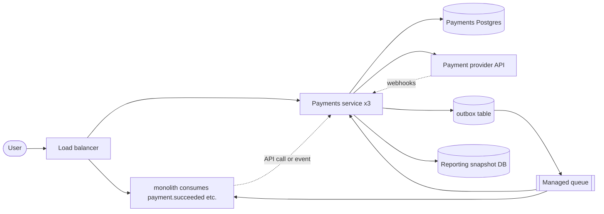

> Real output, not a mockup. This document was produced end-to-end by the skill (eval run, iteration 1 — see evals/README.md). Published verbatim; only this note was added.

# Evolution: Extract Payments into its own service

Date: 2026-08-30 | Status: proposed | Forcing function: **release velocity + blast radius** (feature-velocity/risk class)

## 1. Forcing function — checked against evidence, NOT scale

The stated problem is "payment code blocks releases." That is a **feature-velocity + risk** forcing function, not a scale one. The traffic numbers prove scale is a non-factor:

```
Capacity worksheet (botec.py full --dau 300000 --reads-per-user 2 --writes-per-user 15)
  Read QPS avg / peak                    6.9  / 13.9
  Write QPS avg / peak                  52.1  / 104.2
  Storage/day (x3 replication)          12.57 GiB
  Storage over 5 yr (flat growth)       22.41 TiB
  Hot-set cache (20% of daily reads)    114.4 MiB  -> one small Redis node fits
  App nodes @ 2,000 RPS/node, N+2           3
  In-flight at peak (Little's Law)           3
```

Assumptions behind these numbers (verify in Phase 0): 15 payment-related writes per DAU per day (intent, attempt, ledger line, idempotency key, webhook event — a transaction is ~10-15 rows), 2 payment reads per DAU/day, ~1 KiB per row, 3x replication, 2x peak factor. Sensitivity: even at a conservative 5 writes/user/day the system is at ~17 QPS avg — **the conclusion is identical at any plausible input: 52-104 QPS peak is one Postgres' noise floor (1-5k writes/s primary).** No performance argument justifies this migration.

The real justification is two-fold, and it is sufficient:
1. **Release decoupling** — payment schema migrations and product migrations share one migration train; payment deploys block product deploys. Splitting the deployment unit and (later) the database unblocks independent release cadence. Metric to prove post-migration: deploys/week for product no longer wait on payment changes.
2. **Blast-radius containment** — a payment bug or a product bug currently takes down both; PCI-scoped data sits inside the same database as everything else. After the split, the payment service + its DB are the payment incident and compliance surface.

Demanded evidence (add to the plan before Phase 1 sign-off): last 3 release-blocking incidents with cause attribution, current deploy cadence, and the incident blast radius from the last payment incident. If releases are actually blocked by team contention rather than architecture, note it — but extraction still improves both.

## 2. As-is

See `as-is.md` in this directory. No repository was available to this session, so every finding is marked [ASSUMED]; **Phase 0's audit is a hard gate** — no migration step may start before the SQL/consumer inventory is real, because the #1 mid-migration failure is a hidden consumer of the old tables/joins.

## 3. Target state



**What improves (measurably):**
- Product and payment code ship independently → deploys/week per domain, no cross-blocking.
- Payment schema migrations no longer touch the main DB (after Phase 2) → zero payment-vs-product migration conflicts.
- Incident blast radius: a payment outage degrades checkout, not the whole product; a product outage doesn't break the money path.
- PCI surface shrinks to the payments DB and service.

**What gets worse (named):**
- One extra network hop on the checkout path (monolith → payments API): +0.2-0.5 ms same-DC, plus one more service to operate and observe.
- Order↔payment status becomes **eventually consistent** (event-driven) instead of one transaction: order state can lag payment state by seconds; the checkout confirmation UX must handle a "processing" state.
- Two Postgres clusters to back up, restore-drill, and scale instead of one.

**Exit criteria (from the evolve method):** old path remains fully rollback-able (flags + dual-kept code) until Phase 4. Irreversibility is a dated decision after N clean weeks: error-rate delta < 0.5% vs baseline for 14 days, payment p99 within 100 ms of pre-migration, zero divergence in reconciliation checks, 30 days without a rollback.

## 4. Patterns chosen

| Pattern | Solves | Why chosen (and alternatives rejected) |
|---|---|---|
| **Strangler fig** | Service extraction one flow at a time behind feature flags | The whole point: payments peeled off incrementally; monolith keeps serving everything else |
| **Expand-contract** | API + data ownership split; old shape kept until consumers migrate | Cheapest reversible path; consumer tracking is explicit work |
| **Dual-write + backfill + cutover** | Physical DB split (Phase 3) | Only needed at the physical split; avoided earlier by single-writer discipline |
| **Transactional outbox** | Webhooks/events without dual-write bugs | Non-negotiable per `data-systems.md`: events must reflect committed state. Alternatives (app-level dual-write) rejected — the classic divergence bug |
| **Feature-flag cutover** | Every per-flow switch; kill switch per phase | User-visible money flows need instant rollback; each flag gets a removal date |
| **Managed queue (SQS-class)** | Outbox relay + webhook retries + order-status events | Tier-2 default (`tradeoffs.md`); Kafka is scale theater at 100 msg/s — revisit only at tier 3+ |

**Rejected: modular monolith only.** A modular boundary inside the monolith captures ~80% of the benefit at ~20% of the cost and is a legitimate waypoint (Phase 1 builds exactly that seam). But the stated forcing function — releases blocked by a shared migration train and shared deploy unit — is only fully resolved by a separate deployment unit and separate DB. If the org cannot yet operate a second service (no observability, no on-call), stop after Phase 1/2 and re-evaluate; the seam is still banked.

**Rejected: big-bang move.** "Copy all tables to a new DB and flip everything in one release" fails the reversibility rule and guarantees a missed consumer blows up the cutover.

**Rejected: CDC (Debezium) for the split.** CDC is the fallback when dual-write code can't be added everywhere (e.g., legacy cron writing payment rows directly). Our Phase 0 audit decides: if legacy direct SQL writers to payment tables exist and can't be converted, add CDC. Default is plain expand-contract + single-writer move — simpler.

## 5. Phases

Every phase: action → verification → rollback → soak. A phase without a verification is hope.

| # | Phase | Action | Verification | Rollback | Soak |
|---|---|---|---|---|---|
| 0 | **Instrument & audit** | (a) Dashboards + alerts on every payment flow: p50/p99/error rate, PSP call latency, webhook receipt→processed lag, queue depth, reconciliation diff. (b) SQL/consumer audit: every statement and FK referencing payment tables, every cron/worker writing payment rows, every reporting query joining them, every admin-UI read. (c) Flow inventory: checkout, retry, refund, webhook, subscription/billing, payout, reconciliation. (d) Confirm idempotency coverage today. Output: real as-is map with file:line evidence + consumer list. | Audit checklist 100% done; dashboards live; baseline error metrics recorded ≥ 7 days | n/a | 2-3 wk (not time-boxed; gates everything) |
| 1 | **Extract service (code), same DB** | Stand up Payments service as its own deployable behind the LB: owns checkout, capture/refund, webhook ingest+process, billing jobs. Webhook handling: signature check → idempotent ingest (provider event_id unique) → outbox → managed queue → consumers. All mutation endpoints take `Idempotency-Key`. Monolith routes flows to it per-flag; monolith's payment code stays warm behind flags. | Per-flow: shadow/compare or canary %; error-rate delta < 0.5% and p99 delta < 100 ms vs baseline for 7 days per flow | Flip flag → monolith old path serves again | 2 wk after last flow |
| 2 | **Data ownership split (expand-contract, same cluster)** | Payments service becomes sole writer of payment tables. Monolith: drop cross-domain FKs to payment tables (keep `payment_id` as plain UUID); replace payment-table joins/reads with service API calls or an event-fed read model; re-point reporting/analytics to a snapshot read model built from payment events (eventually consistent, documented). Enforce ownership: revoke app-role DML on payment tables except via service account + a trigger that rejects writes in a 30-day audit window. | Checksum/count parity between payment tables and event-fed read model; trigger audit log shows zero monolith writes; no payment-table access in monolith query plans (pg_stat_statements); reporting queries green on snapshot | Restore FKs + grant monolith DML (code still present) | 3-4 wk |
| 3 | **Physical DB split** | Provision new managed Postgres (multi-AZ, replica, backup+restore drill). Move payment tables via logical replication or dump/restore into new cluster; payments service points at new DB. Because Phase 2 made payments single-writer, this is a **single-writer move**, not a dual-write-forever dance: replicate → catch up → short maintenance window (writes queue: 52/s avg ≈ trivial buffer) → cut → keep old tables read-only until soak. | Row counts + sampled content checksum 100% match; end-to-end checkout/refund on new DB; reconciliation job clean | Point payments service back at old DB (kept warm, read-only) | 4 wk |
| 4 | **Contract (irreversible — dated decision)** | Delete monolith payment code, flags, dual-keep paths, old payment tables. Enforce: app role lacks any privilege on payment schema; drop old tables after archival. Set removal dates at Phase 2, not here. | Final reconciliation clean; error-rate delta vs baseline < 0.5% for 14 days; zero traffic to removed endpoints | none — by design. Requires written sign-off | — |

Rationale for splitting ownership (2) and physical move (3): each is independently reversible; a team under release pressure can stop after 2 and still have unblocked releases — the physical split is the future-proofing/PCI step, and doing it later is cheap because single-writer is already true.

Phases 2+3 may be merged if the Phase 0 audit shows < ~20 consumer/join sites and no legacy cron writes (single-repo team, small admin surface) — fewer total rollback paths. Do not merge if audit shows reporting sprawl.

## 6. Deep dives (the three hard parts)

### 6.1 Cross-DB integrity without distributed transactions

Orders (main DB) and payment state (payments DB) are no longer in one transaction. Options: 2PC (rejected — blocking coordinator, SPOF, and `data-systems.md` says avoid across services); shared-DB forever (rejected — that's the current problem); **event-driven state with a sync read on the money-critical path** (chosen).

- The **write path** stays single-writer: only the payments service mutates payment state; order state updates when the monolith consumes `payment.succeeded`/`payment.failed` events from the outbox. At-least-once delivery + idempotent consumers = exactly-once effects.
- The **checkout confirmation** path (where the user must not see a lie): monolith returns "we're confirming your payment" optimistically, and the final confirmation reads payment status synchronously from the payments API (one same-DC hop, +0.2-0.5 ms — trivial against the PSP's own 50-250 ms TLS+round trip).
- **Cost of the choice:** order status can lag payment by seconds; every consumer of payment state must tolerate "processing/pending" and version the event schema. Revisit if a flow needs strict serializability across domains (none exists in payments; ledger is append-only within the service).

### 6.2 Idempotency (money — non-negotiable)

- Every mutation endpoint: `Idempotency-Key` header; dedup store keyed on it (Redis + DB fallback, Stripe-style stored response).
- Webhook processing: unique constraint on `(provider, event_id)`; side effects (PSP capture/refund calls) guarded by per-entity idempotency (PSP-supplied key) + retry with backoff + jitter.
- Consumers: assume redelivery and reordering; handlers must be side-effect-idempotent or transactionally deduplicated.
- Reconciliation job (daily): compare PSP settlement records vs service ledger; diff ≠ 0 pages on-call. This is the tripwire that proves the whole system honest.

### 6.3 Webhook delivery & PSP calls under the new shape

- Ingest: signature verification → idempotent insert → outbox → queue (bounded) → workers with concurrency caps. Timeouts on every PSP call (never default-infinite); circuit breaker on the PSP client; bulkhead per PSP endpoint so one dead PSP operation doesn't exhaust workers.
- DLQ after N attempts + alert (poison-message protection). Consumer lag alert at > 15 min. Webhook replay tooling from the outbox for provider retries.
- At 52 QPS writes and ~1M events/day this is a managed-queue job, not a streaming platform: SQS-class (~$0.40/M requests → a few dollars/month).

## 7. Failure modes — all 12 injections walked

| # | Injection | Behavior | Mechanism | Residual risk |
|---|---|---|---|---|
| 1 | Dependency down (PSP / monolith / payments DB) | Degrade | Timeouts + circuit breaker on PSP; bulkheads; checkout shows "processing"; payments service and monolith degrade independently; queue buffers webhook ingest | Pending-state UX must already exist pre-migration (Phase 0 check) |
| 2 | 10x traffic spike | Survive | 104 QPS × 10 ≈ 1k QPS still trivial for 3 nodes + one Postgres; LB sheds; queue absorbs webhook burst; autoscale app nodes | Payment service autoscaling needs warm-up — set min=2 |
| 3 | Hot key / hot partition | Survive | Payments are per-user/per-payment partitioned by `payment_id`; no celebrity-key shape; PSP idempotency keys are unique; hot-set cache 114 MiB fits one Redis | Checkout promo (one offer, 300k hits) → mitigate with the existing cache; not payment-critical |
| 4 | Cache stampede | Degrade | Idempotency dedup cache: single-flight + stale-while-revalidate; DB is the fallback store anyway | Slight latency spike only |
| 5 | Retry storm | Survive | Idempotency keys make retries safe by construction; 429 + Retry-After on PSP-throttle; backoff + full jitter on webhook replay | Clients ignoring 429s — mitigated by idempotency |
| 6 | Network partition / split-brain | Survive | Single-writer discipline: one service writes payment DB; no leader election, no fencing tokens needed; monolith side reads only. If a partition isolates payments from PSP, it queues and reports | Webhooks arriving during partition: idempotent ingest makes them safe on replay |
| 7 | Poison message | Survive | DLQ after N attempts + alert; schema validation at ingest; bounded payload size | A poisoned event sits in DLQ until human review — acceptable, alerting on it |
| 8 | Slow consumer / backlog | Degrade | Queue depth alerts at 15 min lag; consumer pool autoscales; outbox relay is cheap to scale; shed order-status events before money events (prioritized queues) | Reporting snapshot lag is acceptable by design (eventual) |
| 9 | Region loss | Degrade→failover | Multi-AZ Postgres is table stakes (RPO ~0 in-region); backups in second region with tested restore (Phase 0 drill); RTO/RPO targets set explicitly. Active-passive multi-region is out of scope at this tier | If region lost entirely: downtime = RTO; accepted at tier 2 |
| 10 | Clock skew | Survive | No wall-clock ordering anywhere: webhook dedup by provider event_id (logical), outbox uses DB sequences, ledger append-only with sequence numbers; NTP + drift monitor | Reconciliation compares provider timestamps vs local — tolerance window, not exact ordering |
| 11 | Cascading failure | Survive | Aggressive timeouts (sum of hop budgets < user SLO); bulkhead per dependency (PSP, monolith API, queue); circuit breakers; fail fast 503 > 30 s hang; separate worker pools | Slow monolith API → payments service unaffected thanks to bulkheads; monitored |
| 12 | Metastable failure | Survive | Queue buffering prevents request-path saturation; caches warm through deploys (rolling restart); load-shed order defined (drop analytics → drop order-status events → keep money ops); manual traffic-drain lever | Watch: PSP circuit breaker half-open retries — fixed by backoff + jitter |

No "die" rows: the design changes that the walk forced were added (bulkheads on PSP, DLQ, idempotent ingest, single-writer discipline) rather than accepted.

## 8. Risks (mid-migration) & mitigation

| Risk | Mitigation |
|---|---|
| Hidden consumer of payment tables/joins (admin UI, reporting, legacy cron) | Phase 0 audit is a hard gate; 30-day trigger audit in Phase 2; old tables kept read-only through Phase 4; consumers re-pointed via read model |
| Divergence between stores during split | Single-writer made true in Phase 2 before any move; checksum/count verification in Phase 3; daily reconciliation job as permanent tripwire |
| Backfill overloads prod | Payments are 52 QPS — backfill at off-peak with rate limit; run against replica; use logical replication, not app-level copy |
| Two writers during cutover (monolith + service both mutating) | Feature-flag discipline: no flow has both paths live; ownership enforcement in Phase 2 (revoke + trigger); flag removal dates set in writing |
| Migration code itself has a bug | Shadow/canary per flow in Phase 1; never skip straight to cutover |
| Release-blocking pressure to skip phases | Written phase gates with owner sign-off; merging 2+3 allowed only under the stated audit conditions |
| Team lacks capacity to operate a second service | Stop after Phase 1/2 (seam banked); require dashboards + on-call runbook as a "do not start" precondition |
| Event-driven order status surprises users | Pending/processing UX verified in Phase 0; sync status read on confirmation path |

## 9. Do not start until

- [ ] Phase 0 audit complete: SQL/consumer inventory, flow inventory, idempotency coverage — with file:line evidence
- [ ] Dashboards + alerts live on all payment flows with ≥ 7 days baseline
- [ ] Backup + restore drill passed on both the current DB and the new payments DB (restore in < RTO, verified data)
- [ ] Reconciliation job exists and is clean against PSP records
- [ ] Rollback runbook written and rehearsed for Phases 1-3 (flag flips, re-point steps)
- [ ] Flag removal dates set for every feature flag created
- [ ] Incident ownership: who is on call for the payments service when it ships

## 10. Right-sizing & cost

- **Tier: 2 (Growth, 50k-500k DAU).** 300k DAU, 52-104 QPS, one managed Postgres, managed queue, small Redis. Everything chosen is the tier-2 default: managed Postgres multi-AZ, SQS-class queue, 3 small app nodes, no Kafka, no k8s, no multi-region.
- **Above-tier components: none.** The service extraction itself is justified by the forcing function (release containment), not scale — and the numbers are quoted to prove scale played no part.

Incremental monthly cost (approximate — verify current pricing):

| Item | Est. $/mo |
|---|---|
| Payments service: 3 small nodes (2+1 spare) | $150-300 |
| Managed Postgres, 2 vCPU/8 GB multi-AZ | $100-250 |
| Storage for payments DB (~13 GiB/day new writes; archive path at ~22 TiB/5yr → move to cold tiers) | $50-150 |
| Redis small (idempotency dedup + hot set) | $30-80 |
| Managed queue (SQS-class, ~30M msg/mo) | $2-15 |
| Load balancer | $15-30 |
| **Total incremental** | **~$350-800/mo** |

Normalized: **~$0.001-0.003 per user per month; ~$0.03 per 1k payment requests.** Top cost levers: right-size the payments DB (this workload is 1-2 vCPU territory; don't over-provision), and archive payment rows older than ~2 years to cold storage early (they're append-only and unreferenced by hot paths).

## 11. Evolution at 10x (3M DAU)

- Payments QPS ≈ 1k writes/s peak: still inside one Postgres primary (1-5k writes/s) but at the edge — the ledger/append-only tables partition by `payment_id` or time first; **archive-before-partition**: 220 TiB/5yr storage is the first breaker.
- Kafka-family only if event consumers multiply (3+ independent consumers or replay/audit needs); managed queue remains correct while it's a relay.
- Multi-region active-passive with async replication for the payments DB (RPO minutes) when latency or DR demands; multi-region writes never for a ledger.
- Tripwires to revisit: reconciliation diff ≠ 0 (immediate); payment p99 > 500 ms for 1 hr; webhook lag > 15 min sustained; queue > 2 consumers with distinct shapes.

## 12. Open questions

| Question | Owner | Needed by |
|---|---|---|
| Confirm the 3 release-blocking incidents and their attribution (architecture vs contention) | Eng lead | Phase 1 sign-off |
| Full inventory of payment-table consumers (audit) | Platform eng | Phase 0 gate |
| Is card data already tokenized end-to-end (PCI scope)? | Security | Phase 2 |
| RTO/RPO targets for payments data | Eng lead + SRE | Phase 3 |
| Reporting team: acceptable staleness for payment read model? | Analytics | Phase 2 |