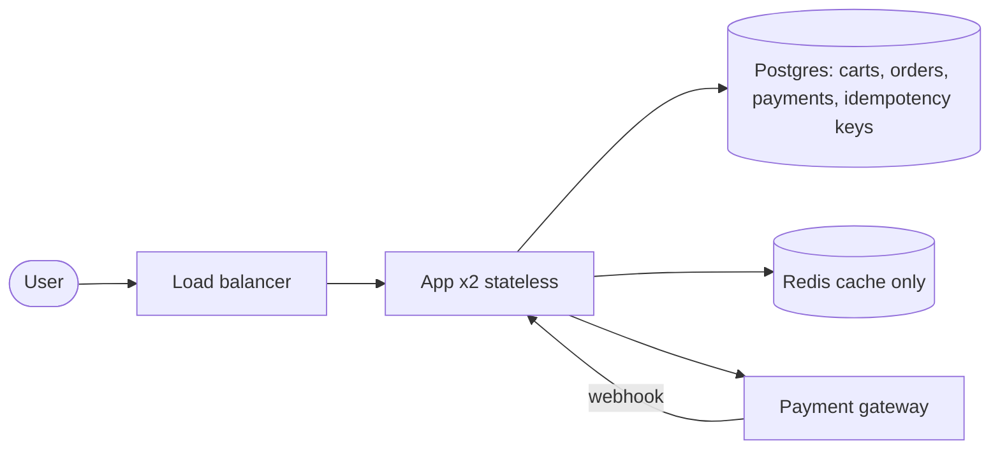

> Real output, not a mockup. This document was produced end-to-end by the skill (eval run, iteration 1 — see evals/README.md). Published verbatim; only this note was added.

# Review: E-commerce checkout (Redis-only cart, sync gateway, singleton fleet)

Date: 2026-08-30 | Verdict: **redesign** (small, well-scoped — not a rebuild)

## Intent (as understood)

An e-commerce checkout where cart state lives only in Redis with no persistence, the payment gateway is called synchronously on the request path with no timeout, the pay endpoint has no idempotency, and the whole system runs on one instance of everything "for now." Stated scale: 50,000 DAU.

This is a tier-1 system at the top edge of its tier (1k–50k DAU, `references/cost.md`). The critical finding up front: **none of the flaws below are scale problems.** Capacity math is trivial at this scale; every blocking flaw is a correctness, durability, or failure-containment flaw that will bite at day one, at any scale.

## Scores

| # | Dimension | Score (1-5) | Evidence (one line) |
|---|---|---|---|
| 1 | Requirements & non-goals | 2 | Scale stated (50k DAU) but no latency/availability targets, no non-goals, no consistency statement for money flows |
| 2 | Capacity & numbers | 2 | No QPS/storage math anywhere; scale stated but never analyzed (see worksheet below) |
| 3 | Data design | 1 | Revenue-bearing mutable state (carts) in an ephemeral store; no durability, eviction policy, or consistency discussion |
| 4 | API & contracts | 2 | No idempotency on pay, no error semantics, no payment-status model stated |
| 5 | Failure containment | 1 | No timeouts, no circuit breakers, no fallbacks — all dependencies assumed healthy |
| 6 | Scalability path | 2 | "One instance for now" with a stateful single Redis; 10x bottleneck (the Redis node) not named |
| 7 | Observability & ops | 2 | No metrics/alerts story for the money path; nothing would catch a duplicate charge or lost carts |
| 8 | Security | 2 | No authN/Z, secrets, or PCI boundary stated for a payment-handling system |
| 9 | Cost & right-sizing | 2 | Cost never estimated; one instance is cheap but under-provisioned for HA, not right-sized |
| 10 | Evolution & migration | 2 | "For now" with no time-box, no tripwires, no plan for moving carts to durable storage |

**Verdict rule applied:** two dimensions scored 1 (data design, failure containment) and 4 S1 flags → **redesign** per `references/method-review.md`. The redesign is additive and small; the shape must change from "Redis-only state + fire-and-pray gateway + singleton fleet" to "DB-backed cart/order + bounded idempotent payment flow + 2-node HA fleet." Nothing else needs to change at this scale.

## Capacity worksheet (Gate 1 — botec.py, `scripts/botec.py full`)

Assumptions (falsifiable): 50k DAU; 20 reads/user/day (product + cart views); 2 writes/user/day (cart mutations + checkout); write 2 KB; read 15 KB; 3x replication; peak factor 3; p99 300 ms.

```
  DAU                                50,000
  Read events/day                    1,000,000
  Write events/day                   100,000
  Read:write ratio                   10:1

  Read QPS avg / peak                11.6 / 34.7
  Write QPS avg / peak               1.2 / 3.5
  Read bandwidth avg / peak          1.39 Mbit/s / 4.17 Mbit/s

  Storage/day (x3 replication)       572.20 MiB
  Storage over 5 yr (growth x1/yr)   1,019.80 GiB
  Hot-set cache (20% of daily writes) 286.10 MiB

  App nodes @ 2,000 RPS/node         2 (min 2 for HA)
  In-flight requests at peak (Little) 10 (= peak QPS x 300 ms p99)
```

Pay endpoint alone: ~5k orders/day (10% conversion) = **0.06 avg / 0.17 peak QPS**; even 2 orders/user/day = 3.5 peak QPS.

Decisions these numbers force:

- ~1 GiB of cart+order data over 5 years ⇒ a small managed Postgres; **no partitioning, no NoSQL, no Kafka** — any of those would be scale theater at this tier.
- 286 MiB hot set ⇒ Redis, if used at all, is a cache, not a storage system.
- 10 in-flight requests at peak ⇒ concurrency is a non-issue; thread-pool exhaustion comes only from *unbounded* waits on the gateway, not from volume.
- 2 app nodes minimum ⇒ the singleton is the availability bug, not the capacity bug.

## Blocking findings (S1)

- [ ] **1. No idempotency on the pay endpoint → duplicate charges.** Every retry — browser retry after a hang, network retry, load-balancer retry, gateway-webhook replay — charges the card again. This is the textbook money-endpoint violation (`references/method-review.md` red-flag catalog).
  *Fix:* client-supplied `Idempotency-Key` per payment attempt; unique constraint on `(order_id, idempotency_key)` in Postgres; on replay return the stored original response (200 with original status), never re-charge. Add a tripwire alert: any second distinct charge for one idempotency key = page on call.

- [ ] **2. Synchronous gateway call with no timeout → hang becomes total outage; outage becomes double charge.** Trace it: gateway slows 10x → every pay request blocks indefinitely → the single instance's threads pile up (cascading failure) → checkout is down for everyone → clients retry, each retry waiting forever → metastable saturation that outlives the trigger. Even if the server hangs forever, the *browser* will time out (~30 s) and the user retries → duplicate charge (compounding flaw #1).
  *Fix:* per-hop timeout budget whose sum fits the user SLO (e.g., connect 2 s, gateway read 5 s, total < 10 s), fail fast with 503 rather than hang, circuit breaker on the gateway dependency (open after N failures, half-open probe), bulkhead (separate thread pool / connection limit for gateway calls so a dead gateway can't eat the API's capacity). After a timeout the charge may still have captured — that's flaw #3's reconciliation.

- [ ] **3. Cart only in Redis with no persistence → all active carts are one restart from gone.** Redis is an in-memory cache: node restart, OOM, `maxmemory` eviction, or failover silently destroys every active cart. At 50k DAU a Redis restart can erase tens of thousands of dollars of pending GMV in one event, with zero recovery path. Cart is also mutable state written via TTL-only coherence with no source of truth to rebuild from — a second violation of the cache-over-mutable-data rule.
  *Fix:* Postgres is the source of truth for carts and orders (a few hundred MiB/5 yr — trivial); Redis is demoted to a read cache with invalidate-on-write, or dropped entirely at this scale (286 MiB hot set fits in process memory). Interim stopgap if Redis must stay primary for a sprint: enable AOF everysec + RDB snapshots, set `maxmemory-policy noeviction` so it fails loudly instead of silently, and document the RPO (≈1 s to minutes) — but treat this as temporary debt with a dated removal.

- [ ] **4. One instance of everything "for now" at 50k DAU → any deploy, crash, or node failure is a total outage.** 50k DAU is the top edge of tier 1, whose default is 2+ app nodes behind a load balancer, a managed DB with a replica, and a Redis cache with a replica. A single app instance means deploys are downtime; a single Redis means the cart loss in #3 is also *unavoidable* on any maintenance; a single DB (assumed) means no replica and no tested restore.
  *Fix:* LB + 2 stateless app nodes (zero-downtime deploys), managed Postgres with synchronous replica + **tested** backup restore (the restore drill is the actual HA), managed Redis with a replica. Total added cost: roughly $150–200/mo (see cost section) — the cheapest insurance in this design.

## Non-blocking findings

- **No payment-status state machine or reconciliation.** After a server timeout, the gateway may still capture the charge minutes later. Need a `payments` state machine (PENDING → SUCCEEDED/FAILED/REFUNDED) advanced by gateway webhooks + a periodic reconciliation query of orders whose status is stale vs. the gateway's ledger. This is the piece that makes flaw #2's timeout safe.
- **No observability story.** Golden signals for `/pay` and `/cart`: error rate, p99 latency, gateway timeout rate, breaker-open duration, cart-loss events (Redis restart/eviction counters), duplicate-charge tripwire, chargeback rate. None of the flaws above would be detectable today.
- **No security statement.** For a payment-adjacent system: define the PCI boundary (cards should never reach app code — gateway tokenization only), authN/Z for user-owned carts (a cart endpoint that trusts a client-supplied user id is an enumeration/abuse bug waiting), secrets handling for gateway credentials, rate limiting on `/pay` (cheap at the LB now, mandatory by tier 2).
- **Redis eviction policy unspecified** — `allkeys-lru` silently deletes carts under memory pressure; `noeviction` fails writes loudly. Pick the loud option, or move carts to Postgres.
- **Cart/session TTL policy unspecified** — "keep cart for N days" needs a stated TTL and a "restore my cart" path that survives logout/device change (which only Postgres can provide).

## Failure-mode walk (Gate 2 — 12 injections, `references/stress-tests.md`)

| # | Injection | Behavior | Mechanism | Residual risk |
|---|---|---|---|---|
| 1 | Redis down | **Die** — all carts lost, no fallback | No DB, no replica, no rebuild path | Rebuilt only by fix #3 |
| 2 | 10x traffic spike | Degrade then die | 350 peak read QPS on 1 node; the real killer is gateway threads accumulating | Load-shedding order undefined; 2 nodes + breakers fix it |
| 3 | Hot key / hot partition | Survive (trivially) | Per-user cart keys, tiny dataset | Single Redis node is a SPOF but not a hot-key problem at this scale |
| 4 | Cache stampede | **Die as data loss** | Redis flush/restart = carts vanish (not a stampede — total loss) | AOF/replica stopgap; DB fixes properly |
| 5 | Retry storm | **Die** — duplicate charges | Client/browser retries on pay with no idempotency, synchronized, no backoff budget | Idempotency keys + 429/503 + Retry-After |
| 6 | Split-brain | N/A (single nodes) | No HA to split | HA must come before split-brain is possible |
| 7 | Poison message | N/A — no queues in design | — | If a queue is added for payments later, add DLQ from day one |
| 8 | Slow consumer | N/A — no queues; analogue is slow gateway | Slow gateway = unbounded thread growth on the singleton | Timeouts + bulkhead (fix #2) |
| 9 | Region loss | **Die** — full outage, no RTO/RPO story | Single instance, single Redis, single DB (assumed) | Multi-AZ managed services + replica; multi-region NOT needed at tier 1 |
| 10 | Clock skew | Degrade | Payment webhook ordering and Redis TTLs depend on clocks; a skewed node can mis-order status transitions | Use DB sequence for status transitions, not wall clocks |
| 11 | Cascading failure | **Die** — the core one | Gateway 10x slower → no timeout → threads pile → singleton exhausts → all checkout down | Timeout budget + circuit breaker + bulkhead (fix #2) |
| 12 | Metastable failure | **Die** | Trigger passes, gateway recovers, but queued requests + browser retries keep saturation self-sustaining; no shedding exists | Fail-fast 503s and breaker break the cycle; add load shedding by priority |

N/A rows are marked with reason; nothing skipped silently.

## Right-sizing & cost (Gates 3–4)

**Tier: 1** (50k DAU = top of 1k–50k band; shape = 2+ app nodes, managed DB + replica, Redis cache, managed queue for jobs). The stated design is *under*-engineered for its tier — every component of the tier-1 default is missing. Explicitly rejected (scale theater at this scale): message broker, microservices, multi-region, sharding, event streaming. **Fix #2's payment queue is optional** — at 0.06–3.5 pay QPS a synchronous bounded call with idempotency + webhook reconciliation is defensible; add a queue when the gateway call needs retries with backoff or long waits.

Target-state monthly cost (approximate — verify current pricing; catalog: `references/cost.md`):

| Item | Monthly |
|---|---|
| 2 VMs 4 vCPU/16 GB (reserved) | ~$100 |
| Managed Postgres 2 vCPU multi-AZ + replica | ~$150–250 |
| Managed Redis small + replica | ~$50–80 |
| Load balancer | ~$20 |
| **Total** | **~$320–450/mo** |

Normalized: **~$0.007–0.009 per DAU per month**; fixed cost ~$0.01 per 1k requests at current volume (marginal cost per request is negligible at this scale). Top cost lever: right-size the DB (2 vCPU is plenty for ~1 GiB).

## Target shape (sketch)



- Read path: GET /cart → cache hit in Redis or app memory; miss → Postgres → populate cache.
- Write path: cart mutations and order creation write Postgres (source of truth), invalidate cache.
- Pay path: POST /pay with Idempotency-Key → dedup check → state PENDING in Postgres → gateway call under 5 s timeout budget with breaker → status update → webhook advances state (fixes #2/#3 reconciliation).

## What to re-review after fixes

- [ ] Idempotency key enforced at the DB level, replay returns original response, duplicate-charge tripwire alert exists
- [ ] Every outbound call has a timeout budget whose sum < user SLO; circuit breaker present; fail-fast 503s on gateway failure
- [ ] Carts and orders read/write Postgres as source of truth; Redis (if kept) is cache-only with invalidate-on-write
- [ ] 2 app nodes behind LB; DB replica + **tested** backup restore drill documented; zero-downtime deploy demonstrated
- [ ] Payment state machine + webhook reconciliation; golden-signal dashboards for /cart and /pay
- [ ] Non-goals, latency/availability SLOs, and a "for now" time-box with tripwires written into the doc

## Evolution (what changes at 10x: 500k DAU, tier 2)

- Breaks first: none of the current flaws — by then they're fixed — but the DB becomes the focus (read replicas, then partition if needed).
- Next steps at 500k DAU: read replicas + cache strategy tightening, rate limiting at the LB, async payment pipeline with retry queue + DLQ if gateway latency grows, SLOs + dashboards as formal contract, multi-AZ already in place.
- Tripwires to revisit: gateway p99 > 2 s sustained, pay error rate > 1%, chargeback rate up, Redis eviction events > 0.