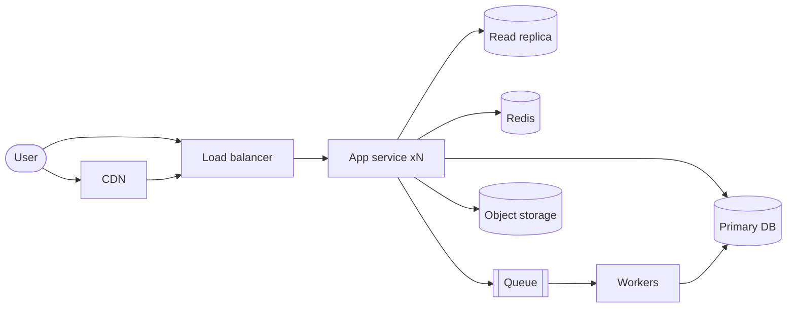
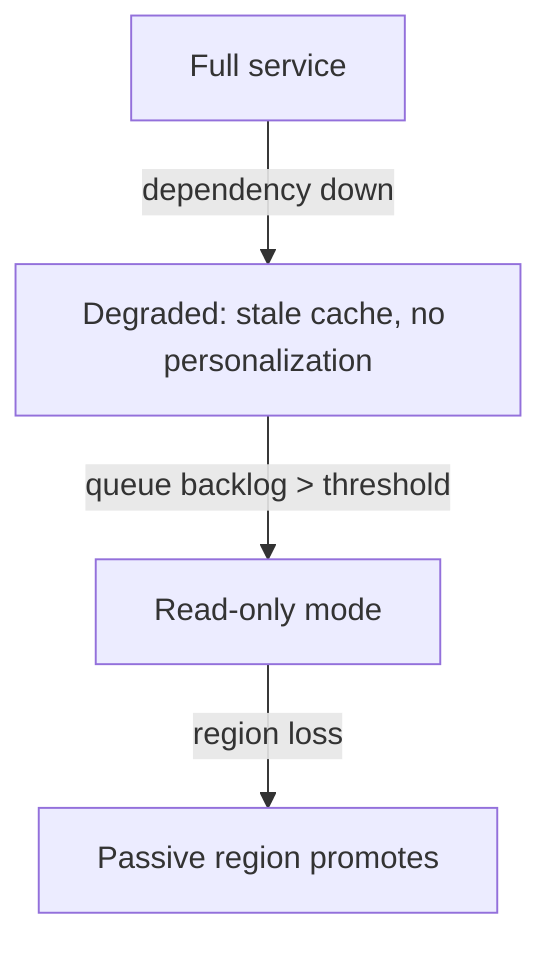

# Output templates

Artifacts this skill produces, with templates and Mermaid snippets. Copy the template; every section is mandatory unless marked optional. Files go in the repo's docs/ tree so they can be reviewed and diffed.

## Contents
- [Design doc](#design-doc)
- [As-is architecture map](#as-is-architecture-map)
- [Review report](#review-report)
- [Evolution/migration plan](#evolutionmigration-plan)
- [Mermaid snippets](#mermaid-snippets)

## Design doc

Path: `docs/design/YYYY-MM-DD-<name>.md`

```markdown
# Design: <name>
Date: YYYY-MM-DD | Status: draft | Author: <who>

## Context
2-5 sentences: what problem, why now, what constraints (business + technical).

## Requirements
### Functional
- (2-5 verbs, the core only)
### Non-functional
- Scale: (DAU, QPS, storage horizon — from botec output)
- Latency: (p50/p99 targets per critical flow)
- Availability: (nines, per flow)
- Consistency: (per-flow: strong/causal/eventual + why)
### Non-goals
- (what this design deliberately does not handle, and why)

## Assumptions & estimates
(paste botec.py output; list assumptions as falsifiable bullets)
- Decision forced: "X TB / 5 yr => ..." (one per major component)

## High-level design
(API surface, data model, diagram below, one read-path walk, one write-path walk)

```mermaid
(see snippets below)
`` `

## Deep dives
### <component 1 — the hardest part>
Options considered -> choice -> cost -> revisit trigger.
### <component 2>

## Failure modes
| # | Injection | Behavior (survive/degrade/die) | Mechanism | Residual risk |
|---|---|---|---|---|
| 1 | Dependency down | | | |
(... all 12 from stress-tests.md ...)

## Right-sizing & cost
- Tier: N because <evidence>
- Above-tier components: (none, or justified)
- Estimated monthly cost: $X (breakdown table); cost per 1k requests: $Y
  (approximate — verify current pricing)

## Evolution
- Breaks first at 10x: <component>
- Next step at 10x: <what changes>
- Tripwires to revisit: (metric + threshold)

## Open questions
- (question, owner, needed-by)
```

## As-is architecture map

Path: `docs/architecture/as-is.md`

```markdown
# Architecture (as-is)
Date: YYYY-MM-DD | Codebase state: <commit/ref>

## Summary
3 sentences: what this system does, for whom, at what scale (or "unknown — no metrics found").

## Container diagram
```mermaid
(see snippets)
`` `

## Component inventory
| Component | Location (path) | Technology | Role |
|---|---|---|---|

## Request flows
### <flow 1 — read>
entry -> ... -> store (one line per hop; cite file:line)
### <flow 2 — write>

## Data stores
| Store | Writers | Readers | Source of truth? | Consistency mechanism |
|---|---|---|---|---|

## Infrastructure & delivery
(deploy targets, CI, environments, migrations, observability present/absent)

## Risk register
| Risk | Evidence (file:line) | Severity (S1-S3) | First fix |
|---|---|---|---|

## Not read / unknown
(what this map did NOT cover — honesty section)
```

## Review report

Path: `docs/architecture/reviews/YYYY-MM-DD-<target>.md`

```markdown
# Review: <target>
Date: YYYY-MM-DD | Verdict: ship | fix-then-ship | redesign

## Scores
| # | Dimension | Score (1-5) | Evidence (one line) |
|---|---|---|---|
| 1 | Requirements & non-goals | | |
| 2 | Capacity & numbers | | |
| 3 | Data design | | |
| 4 | API & contracts | | |
| 5 | Failure containment | | |
| 6 | Scalability path | | |
| 7 | Observability & ops | | |
| 8 | Security | | |
| 9 | Cost & right-sizing | | |
| 10 | Evolution & migration | | |

## Blocking findings
- [ ] <finding, why it blocks, the fix>
## Non-blocking findings
- <finding + suggestion>
## Re-review after fixes
<what must be true to clear the verdict>
```

## Evolution/migration plan

Path: `docs/architecture/YYYY-MM-DD-<evolution>.md`

```markdown
# Evolution: <name>
Date: | Status: proposed | Forcing function: <scale/cost/feature/risk + evidence>

## As-is
(link to as-is.md; 3-line summary of what's relevant)

## Target state
(diagram or diff-from-as-is; what improves measurably; what gets worse — name it)

## Patterns chosen
(pattern -> which problem it solves -> why alternatives rejected)

## Phases
| # | Phase | Action | Verification | Rollback | Soak |
|---|---|---|---|---|---|
| 0 | Instrument | ... | ... | n/a | ... |

## Risks (mid-migration)
| Risk | Mitigation |
|---|---|

## Do not start until
- [ ] (preconditions: dashboards exist, backup restore tested, ...)
```

## Mermaid snippets

**Container diagram** (C4-flavored):



**Write/read path sequence:**

```mermaid
sequenceDiagram
    participant C as Client
    participant A as API
    participant Q as Queue
    participant W as Worker
    participant D as DB
    C->>A: POST /orders (Idempotency-Key)
    A->>D: BEGIN; insert order + outbox event; COMMIT
    A-->>C: 202 Accepted
    Q->>W: deliver event
    W->>D: mark fulfilled (idempotent)
```

**Degradation ladder** (nice for DR sections):



Rules: Mermaid-first (renders on GitHub). Keep diagrams under ~15 nodes; split if bigger. Label edges with protocols only when it matters. Every diagram needs a text walk-through next to it — the diagram supports the prose, not replaces it.
